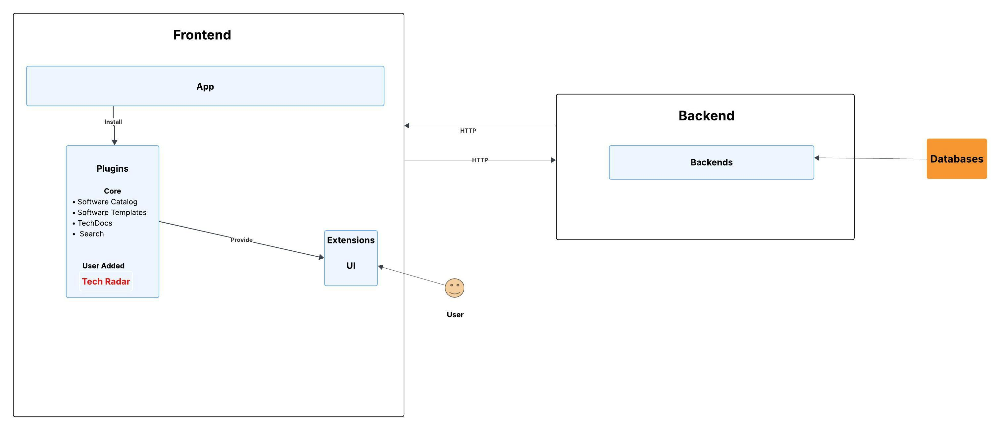
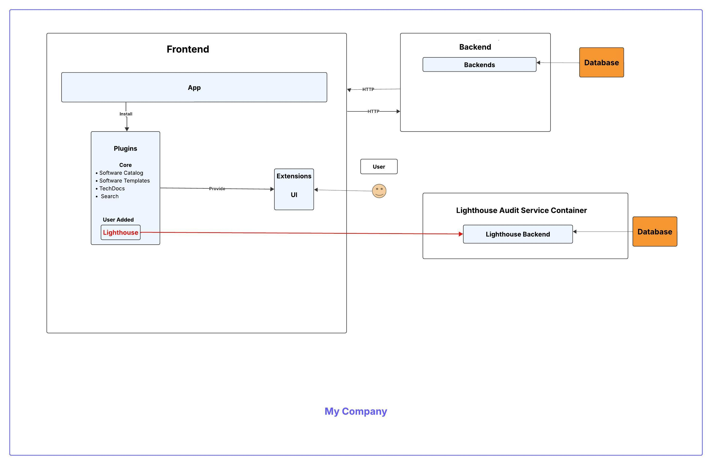
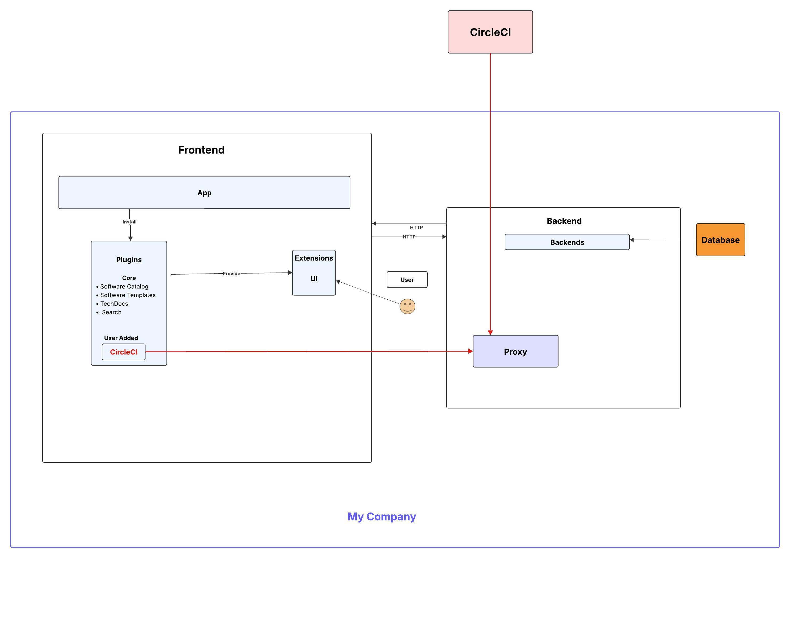
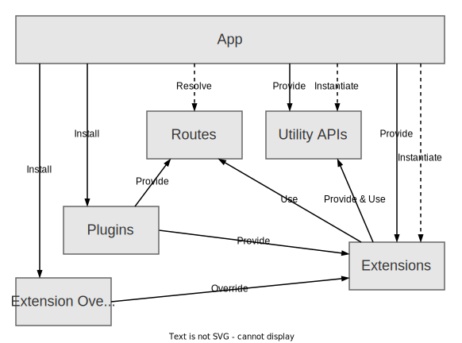
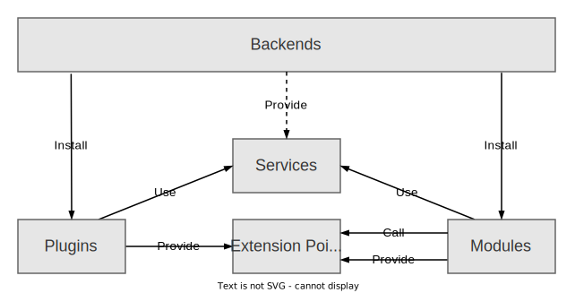
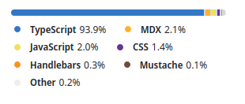
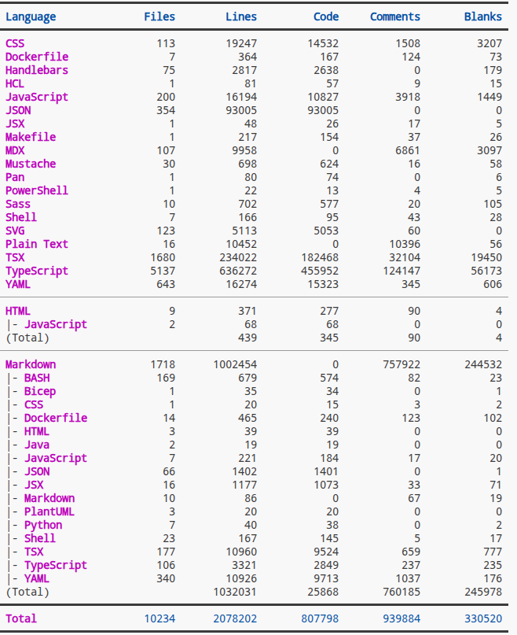
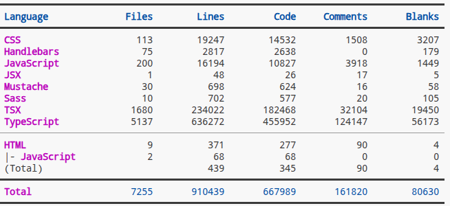
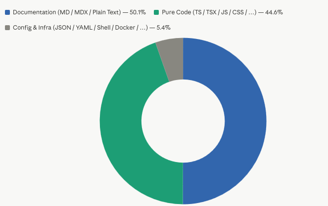

# Overview

## What is _Backstage_?
_Backstage_ is a portal that aims at grouping several utilities useful for developers such as libraries, cloud services, tools, APIs and so on, referred to as _components_. This way it's not necessary to look for them in different sources. Thanks to the plugin architecture it is possible to customise each _Backstage_ deployment to fit the needs of every adopting company.

## Main Stakeholders

### Internal
- Spotify 
- Software Engineers
- Tech Lead

### External
- CNCF
- Plugin Providers
- [Adopting companies](https://github.com/Group06-SwDA/Backstage_snapshot/blob/master/ADOPTERS.md)
- Engineering managers and end users (developers)

## How does _Backstage_ work?
### Plugin System 
_Backstage_ is just a skeleton and many functionalities are implemented using plugins. Plugins might be completely standalone or built on top of existing plugins to improve their features. There are three types of them:

- Core Plugins: _Backstage_ needs them to work since they implement the basic features such as the _Software Catalog_, _Software Templates_, _Tech Docs_, _Search_ and _Kubernetes_
- Open Source Plugins: created by companies or independent developers. Some examples are plugins for GitHub integration, Datadog and AWS.
- Custom Plugins: each company can develop their own plugins to integrate proprietary tools.

There is another classification of plugins according to their architecture:

- Standalone: Run entirely in the browser and do not make API requests to other services. Once the plugin is added its informations are visible in the Backstage UI.
<br>Below an example with Tech Radar Plugin.

- Service Backend: they make API requests within the Backstage ecosystem, so Software Catalog is an example.
<br>Below an example with Lighthouse Plugin.

- Third-party Backend: they make API requests outside the Backstage ecosystem.
<br>Below an example with CircleCI Plugin.
 

### Software Catalog 
It helps to uniform components and makes all the software accessible.
Components can be added to the catalog in three ways:

- Manual Registration
- Creation through Backstage using Software Templates
- External source integration

The Catalog System Model is based on _entities_. There are _core entities_ that are owned by _organizational entities_.
Core entities are:

- Components
- APIs: implemented by components, they have different restriction levels.
- Resources: are physical or virtual infrastructure that allow components to operate.


### Software Templates
They aid the creation of Backstage components. Generally templates consist of many steps and each step has optional or mandatory input.
Each run of a template is identified by a unique ID. Templates are stored in Software Catalog. Once many templates are created, _ScaffolderPage_ can be customised to group and filter certain templates.

### Tech Docs
They are markdown files written by engineers to provide code documentation. It is a docs-like-code solution directly built into Backstage. Starting from markdown files _TechDocs Generator_ transforms them into static HTML files which are stored by _TechDocs Publisher_ in a storage system. The files are integrated in the Backstage UI using _TechDocs Reader_.     

### Search
It is not a search engine but provides an interface between Backstage and an actual search engine such as _ElasticSearch_, _Lunr_, _Postgres_. 
It is used to look for components in the Backstage ecosystem. It is possible to personalize both search page composition and search results view thanks to many search components that can be used in both contexts.   
Through _Collators_ ,which are readable object streams, it is possible to define what can be searched. One collator defines and collects documents of a type which have to conform to a minimum set of fields. 
_Decorators_ allow to give extra information about the searched components. It is also used for adding, removing and filtering documents and their metadata at index-time. The index is rebuilt on a schedule which can be different for each collator.

### Kubernetes
It allows developers to check their services' status on a local host or in production directly to Backstage.

### Frontend
The app does not have any direct functionality except the one of wiring the things together.
<br>
>The schema shows how blocks interact with eachother.

Extensions allow the instantiation and visualization of the app.
Each one of them is attached to a parent which may have more than one child. The app builds an _app extension tree_ which is a single tree that keeps all extensions together. There are also extension overrides which are high priority extensions and allow to override individual extensions or install new ones. Through _Utility APIs_ it is easier to build plugins. They are implemented by extensions that are provided. 
Only the App knows Plugins URLs and resolves routes so that plugins do not have to know URLs to call eachother. 

### Backend
Like the frontend, it does not have any direct functionality except the one of wiring the things together.
<br>
>The diagram shows how blocks interact with eachother.

It is possible to implement more than one backend deployments depending on the need to isolate or scale individual features. Plugins do not communicate with eachother directly so each plugin can be considered as a microservice. Services provide a simpler plugin implementation. It is possible to override services to customize them. Like services Extension Points are a way to extend plugins but they are provided by Plugins or modules themselves.
Modules aim to add features using extension points. Each module can use extension points belonging to only one plugin.
The code is organised using NPM packages.


## Basic Code Statistics
### Contributors 
To count the number of project contibutors it's been used: 
```
bash
git shortlog -sn | wc -l
```
>2349.
### Languages



Using _tokei_ with this command gives the following output which is the total amount of files, lines of code without comments and blanks.

```bash
tokei .
```


Using the following command the output is just the application code without documentation, infrastructure and configuration.
```bash 
tokei . -t TypeScript,TSX,CSS,Handlebars,JavaScript,Sass,JSX,Mustache,HTML
```


Considering Markdown, PlanText and MDX as documentation; JSON, YAML, Shell, PowerShell, HCL,PAN, Dockerfile and Makefile as configuration and infrastructure the ratios are the following:



Using the following command to find the number of packages except external dependencies. 

```bash
find . -name "package.json" -not -path "*/node_modules/*" | wc -l
```
>253
