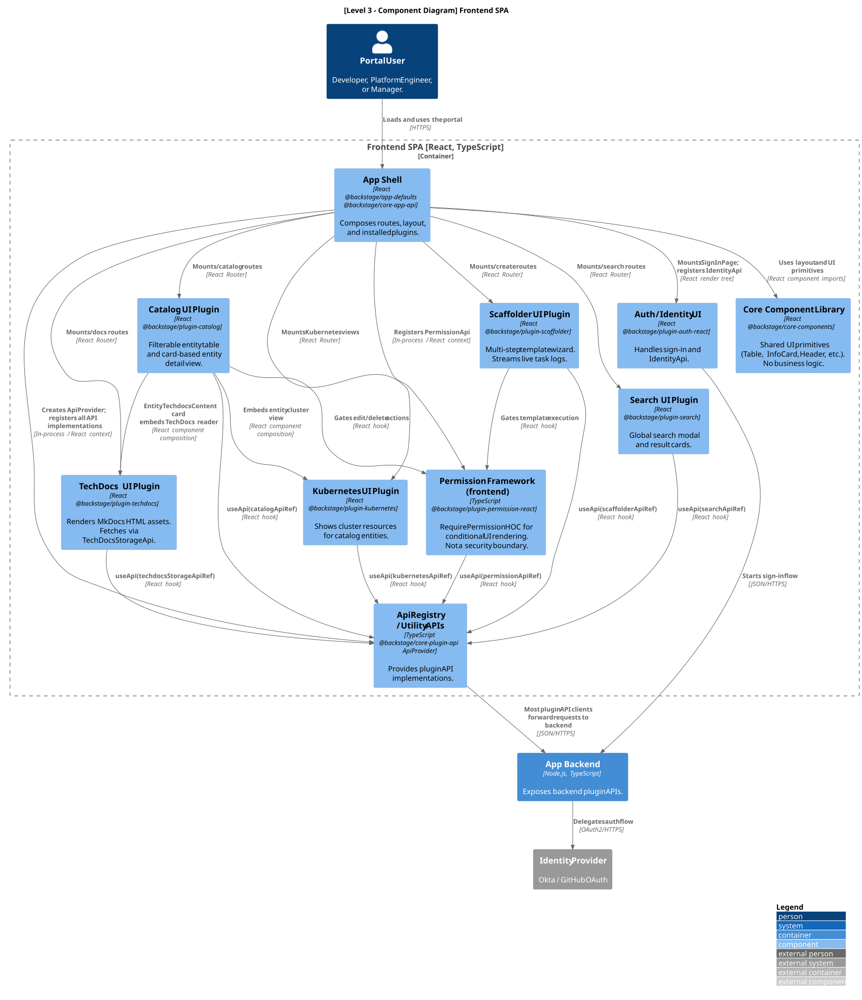

# Software Architecture Report: Backstage

**System:** [Backstage](https://github.com/backstage/backstage)  
**C4 diagrams tool:** PlantUML with the C4-PlantUML standard library

---

## 1. Context Level

### Diagram

### Explanation

Backstage is an internal developer portal framework — one place for engineering teams to discover services, read documentation, understand ownership, and scaffold new projects from approved templates.

Three groups use the portal:

- **Developers** — primary users. Register services via `catalog-info.yaml` descriptors, browse the catalog, read TechDocs, scaffold new projects.
- **Platform Engineers** — maintain the instance: configure plugins, integrations, authentication.
- **Engineering Managers** — mostly read-only: ownership, team structure, ecosystem health.

Backstage depends on five external systems:

- **Source Control** (GitHub, GitLab) — reads `catalog-info.yaml` files and creates repositories through Scaffolder templates.
- **CI/CD** (Jenkins, GitHub Actions) — build/deploy status surfaced through dedicated frontend plugins and entity annotations; handled at plugin layer, not core Catalog.
- **Cloud Infrastructure** (Kubernetes, AWS, GCP) — queried for runtime and resource info.
- **Identity Provider** (Okta, GitHub OAuth) — authenticates users, resolves group membership mapped to `User`/`Group` entities.
- **Object Storage** (S3, GCS, Azure Blob) — stores generated TechDocs HTML assets when an external publisher is configured.

---

## 2. Container Level

### Diagram

### Explanation

- **Frontend SPA.** React/TypeScript SPA in the browser. Mainly a composition layer: wires installed frontend plugins (Catalog UI, Scaffolder UI, TechDocs, Search) into one portal. Plugins share functionality via Utility APIs and link through routing. Reaches external systems only through the App Backend.
- **App Backend.** Node.js/TypeScript runtime hosting backend plugins. A typical deployment runs several plugins in one process, logically isolated. Acts as composition root and DI container: wires plugins, shared services (logging, config, database, cache), and modules. Plugins coordinate through defined APIs, not shared internals — making a later split into separate backend deployments feasible (with config/ops changes).
- **PostgreSQL.** Main durable store in production. Access scoped per plugin (separate DBs or isolated tables/migrations), reducing coupling.
- **Cache Store.** Optional Redis or Keyv-compatible cache; per-plugin namespace avoids key collisions.
- **Object Storage.** Modeled external — a managed third-party service. Backstage reads/writes TechDocs assets there but does not deploy it.

### Relationship With Clean Architecture

Backstage doesn't implement Clean Architecture in strict textbook form, but its design is broadly compatible: domain logic stays away from infrastructure, dependencies flow inward toward stable abstractions, and concrete infrastructure is wired in at the outermost composition layer.

| Clean Architecture Layer | Backstage Equivalent |
| --- | --- |
| **Entities** | Shared domain packages such as `catalog-model`, defining entity types (`Component`, `API`, `User`, `Group`…) with no dependency on Express, PostgreSQL, Redis, or any frontend framework. |
| **Use Cases** | Application-level backend plugin logic: Catalog ingestion, entity processing, validation, stitching, and Scaffolder task orchestration (template + parameters → fetch/transform/publish → scaffolded repo). |
| **Interface Adapters** | REST route handlers in backend plugins, the `catalog-client` package translating HTTP responses into typed domain objects, frontend API clients, and React presenter components. |
| **Frameworks and Drivers** | The `app/` and `backend/` composition roots, Express routing, Knex database access, Keyv cache, identity providers, source-control integrations. |

Dependencies follow the Clean Architecture rule at package level. `catalog-client` is a clear Dependency Inversion case — consumers depend on the `CatalogApi` interface, not Catalog internals — and the backend resolves typed service references at the composition root. Plugins sharing one process still share logger, DB, cache, scheduler, config via the DI container, but as abstractions, so inversion still holds with a service interface (not a separate process) as the boundary. Boundary discipline — only typed domain data crossing, never raw DB rows — is enforced by package boundaries, `@internal` annotations, and code review rather than one universal compile-time rule.

### 2.1 Persistence Model

DB access goes through a shared `DatabaseService` (`coreServices.database`) injected into every backend plugin. Each plugin gets its own scoped Knex instance — never a raw connection — keeping query construction, dialect handling, and pooling in one contract.

Isolation is **logical, not physical**. By default all plugins share one PostgreSQL instance with separate logical scopes:

- **PostgreSQL** — schema-per-plugin (`catalog`, `scaffolder`, `auth`, …); plugin ID maps to schema name.
- **SQLite** — separate file per plugin (dev/test only).
- **Overrides** — `backend.database.plugin.<id>` in `app-config.yaml` can point a plugin at a different physical DB for true tenant isolation.

Migrations live next to plugin code (`migrations/` per plugin), run at startup via Knex. Pooling uses Knex pool (PgBouncer-compatible in transaction mode).

**Trade-off.** Same physical DB keeps ops simple — one cluster to back up, one credential to rotate. Cost: a runaway query in one plugin can starve the shared pool. Mitigations (per-plugin overrides, connection-limit tuning) exist but need explicit config.

---

## 3. Component Level

### 3.1 Container Selection and Scope

Level 3 zooms inside a container. This report expands two Level 2 containers — **App Backend** and **Frontend SPA** — plus a deeper view of the **Catalog Plugin**, a component view *inside* the App Backend, not a separate container. App Backend is expanded because ingestion, scaffolding, auth, search, permissions, and most integrations live there. Catalog earns its own view because every major feature depends on its metadata, and its provider/processor/stitching pipeline illustrates the core patterns best. Frontend SPA is expanded because it has its own plugin system, DI, routing, and isolation rules mirroring the backend.

### 3.2 App Backend Components

#### Diagram

#### Explanation

The view shows the Backend System / DI Container, six core plugins, three shared core services (Scheduler, Discovery, Auth), and one optional CI/CD integration. Default deployment shares one process but keeps separate plugin boundaries.

| Component | Role |
| --- | --- |
| **Backend System / DI Container** | Hands each registered plugin the services it declared — database, logger, cache, config, scheduler, discovery — so no plugin constructs concrete infrastructure itself. |
| **Catalog Plugin** | Ingests `catalog-info.yaml`, runs the processing pipeline, resolves relations, stitches entities, exposes the Catalog REST API. Consumed externally via the `CatalogApi` interface. |
| **Scaffolder Plugin** | Turns each request into an async task: fetch template → transform with user input → create repository → publish. Persists task state and logs; can check permissions before sensitive actions. |
| **Auth Plugin** | Sign-in flows per identity provider. The `SignInResolver` maps an external identity to a Backstage user and catalog entity; OAuth providers act as adapters behind one contract. |
| **TechDocs Plugin** | Docs-as-code. Local setup: generates docs via MkDocs. Production: CI generates, Backstage serves static assets from object storage. |
| **Search Plugin** | Background collators build search documents from Catalog/TechDocs; a REST endpoint queries the engine — Lunr, PostgreSQL, or Elasticsearch/OpenSearch — behind a `SearchEngine` interface. |
| **Permission Plugin** | Evaluates access-control policies and returns allow/deny. Backend plugins must still enforce server-side; frontend checks are UX only, not a security boundary. |
| **TaskScheduler (core service)** | DB-locked distributed cron. Provides leased tasks (`scheduler.scheduleTask({ frequency, scope: 'global' })`) used by Catalog refresh loop, Search indexing, TechDocs sync, and Auth provider token refresh. Leases prevent duplicate execution across backend replicas — the mechanism behind the stateless horizontal-scaling claim in §4. |
| **DiscoveryService (core service)** | Resolves `pluginId → baseURL`. In monolith deployment all IDs resolve to the same host; in a split deployment, configuration points each plugin ID at its own backend. Same plugin code works in both topologies — the contract that makes the "splittable" claim concrete. |
| **AuthService (core service)** | Issues and validates service-to-service tokens for backend-internal plugin calls (e.g. Search calling Catalog). User-on-behalf tokens forwarded separately. Required once plugins live in different processes; transparent in monolith mode. |
| **CI/CD Integration / Proxy** | Optional. Dedicated plugins or proxy routes fetch build/deploy status (Jenkins, GitHub Actions, Buildkite…) via entity annotations — not a Catalog responsibility. |

**Cross-plugin communication.** Plugins depend on API contracts (e.g. `CatalogApi`), never on each other's internals — preserving boundaries and making a later split into independent deployments feasible.

### 3.3 Catalog Plugin

#### Explanation

This view zooms inside the Catalog Plugin — a component view within the App Backend, not a separate container.

| Component | Role |
| --- | --- |
| **CatalogRouter** | Public REST API for catalog operations (list, fetch by reference, register locations, validate). Interface adapter: translates HTTP into calls on catalog services. |
| **CatalogBuilder** | Plugin-level composition root. Registers entity providers, processors, policies, and the processing engine at startup; assembles extension points. |
| **EntityProvider** | Adapters for entity sources (GitHub, GitLab, LDAP, static location). Feed raw entity data in without the catalog knowing provider specifics. |
| **RefreshStateStore** | Tracks refresh state of raw entities and locations — what to process, when to retry, which errors occurred. |
| **CatalogProcessingEngine** | Coordinates the processing loop: claims due entities, applies processors, stores emitted relations/errors, triggers stitching. |
| **EntityProcessor** | Validates, enriches, and transforms raw entities; emits relations, errors, derived entities. Ports-and-Adapters: interchangeable extension points around a stable pipeline. |
| **StitchingOrchestrator** | Assembles the final visible entity from processed data, relations, errors, and referenced entities. Entities are exposed only once fully stitched. |
| **EntitiesCatalog** | Read/write facade over the entity store, hiding database access behind a catalog-specific interface. |
| **CatalogClient / CatalogApi** | Public API boundary for external consumers. Frontend and other plugins depend on this, not on internals — the clearest Dependency Inversion case in the diagram. |

### 3.4 Frontend SPA Components

#### Diagram

#### Explanation

The Frontend SPA is itself a composition runtime: it assembles frontend plugins into one portal rather than holding all UI logic directly.

| Component | Role |
| --- | --- |
| **App Shell** | Frontend composition root. Mounts top-level routes, provides theme/layout, registers plugins, builds the sidebar and the API provider. |
| **ApiRegistry / Utility APIs** | Frontend dependency injection. Plugins request APIs via `useApi(apiRef)` instead of constructing clients, so implementations can be swapped without touching UI code. |
| **Auth / Identity UI** | Sign-in page and OAuth redirect flow. Exposes identity and tokens so plugin clients call backend APIs on the user's behalf. |
| **Catalog UI Plugin** | Catalog index and entity detail pages. Fetches via `CatalogApi`; uses entity-aware layouts (`EntitySwitch`) to render a different view per entity kind. |
| **Scaffolder UI Plugin** | Template list, parameter wizard, task progress. Calls the Scaffolder backend via `ScaffolderApi` and streams task logs. |
| **TechDocs UI Plugin** | Documentation index and reader. Links catalog entities to docs and fetches rendered static assets from the TechDocs backend. |
| **Search UI Plugin** | Search page, modal, bar, and result list. Other plugins can contribute custom result renderers — another composition point. |
| **Permission Framework** | Hooks and components (`usePermission`, `RequirePermission`) to hide UI actions. UX only — backend enforcement is still required. |
| **Core Component Library** | Reusable presentation components (tables, headers, sidebars, progress, empty states). Shared UI infrastructure, not business logic. |

### 3.5 SOLID Violations

The catalog ingestion pipeline (`plugins/catalog-backend`) — providers, processors, processing engine, stitcher, database access — contains the most significant SOLID violations in the system. **OCP, LSP, and DIP are respected**: new providers/processors are added via extension points without core edits; processors honour the optional-method contract; and engine/orchestrator dependencies are all constructor-injected as abstractions.

| Principle | Status | Notes |
| --- | --- | --- |
| **SRP** | Violated (high) | `DefaultCatalogProcessingEngine` — file 510 LOC, class itself ~330 — mixes pipeline lifecycle, per-task orchestration, hash-based change detection, cache-TTL bookkeeping, orphan cleanup, error-event publishing, and observability (tracing + metrics). Six-plus distinct reasons to change. A maintainer comment in the file itself notes the engine area is historically tangled. |
| **SRP** | Minor smell | `DefaultCatalogProcessingOrchestrator` (464 LOC) sequences the five-stage processor pipeline — its legitimate single job. Genuinely separable concerns (output collection, processor cache) are already delegated to `ProcessorOutputCollector` and `ProcessorCacheManager`. Residual smell: inline entity validation and catalog-rules enforcement could be uniform pluggable steps. Not a god class. |
| **ISP** | Violated | `CatalogProcessor` (`plugin-catalog-node`) bundles four separable lifecycle roles — `readLocation`, `preProcessEntity`, `validateEntityKind`, `postProcessEntity` — plus `getProcessorName`/`getPriority` in one type. All lifecycle hooks are optional, so the orchestrator must feature-detect each at runtime (`if (processor.preProcessEntity)` …) — proof that clients depend on a broader type than they use. |

---

## 4. Architectural Characteristics

Backstage's **driving characteristic is extensibility**; the others serve it or are constraints accepted to reach it.

| Characteristic | How the architecture supports it | Trade-off / limit |
| --- | --- | --- |
| **Extensibility / Modifiability** | Plugin boundaries (each feature = own package, routes, DB scope); extension points (typed hooks — no forking); DI via `ServiceRef` / `ApiRef` (depend on interfaces, swap implementations) | High learning curve; many packages to govern |
| **Testability** | Falls out of DI — no plugin imports a concrete dependency, so mocks inject through the same `ServiceRef` / `ApiRef` used in production | — |
| **Scalability** | Stateless backend (no in-memory sessions, no local disk writes) → horizontal scaling is a replica-count change, no code change. `TaskScheduler` leases via DB ensure scheduled jobs (catalog refresh, search indexing) execute exactly once across replicas. | Plugins can't scale independently in the single-process default — a CPU-heavy plugin scales with everything else. |
| **Maintainability** | Yarn monorepo — one lockfile, one toolchain (`@backstage/cli`); cross-plugin refactors atomic | CI cost across 100+ packages |
| **Fault isolation** | Plugin-scoped DB connections, no shared mutable state — one plugin's data fault can't corrupt another | Single process: an unhandled crash still drops all plugins |
| **Deployability** | HTTP-only inter-plugin communication, `DiscoveryService` for URL resolution, and `AuthService` plugin tokens for service-to-service auth mean the same plugin code runs in monolith or split topology. Splitting requires only config (per-plugin discovery URLs + auth keys), not refactoring. | Split needs startup-order coordination, separate config, separate observability, and ownership clarity per plugin — the per-plugin DB scope helps but doesn't remove the operational cost. |

**Net:** the architecture genuinely supports its driving characteristic; the recurring cost is the single-process default trading per-plugin independence for operational simplicity.

---

## 5. Conclusion

Backstage's defining decision is that plugin boundaries are the product. It accepts the cost of DI, API contracts, extension points, and plugin-scoped persistence so an organization can assemble a portal from independently evolving features.

The central trade-off is centralization vs independence. The Catalog is the semantic hub that makes the portal coherent — but that centrality makes catalog data quality a system-wide dependency: weak annotations or ownership degrade Search, TechDocs, and Permissions alike.

The architecture provides the right mechanisms; the main risk is internal discipline. The `catalog-backend` pipeline shows this — clean, tool-enforced *external* boundaries can still hide oversized *internal* components. Improvement belongs there: stricter API contracts and tighter components, not a different container structure.
