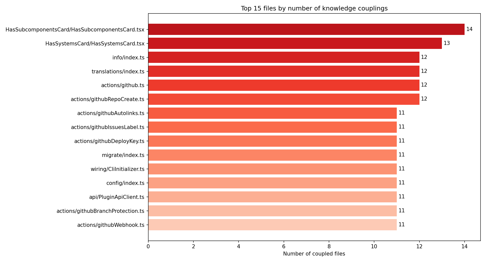
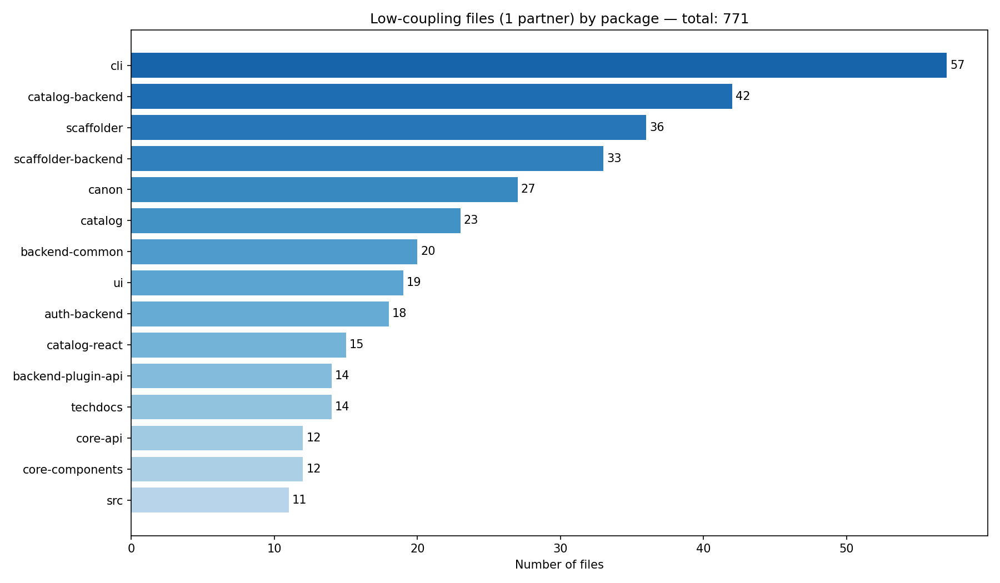
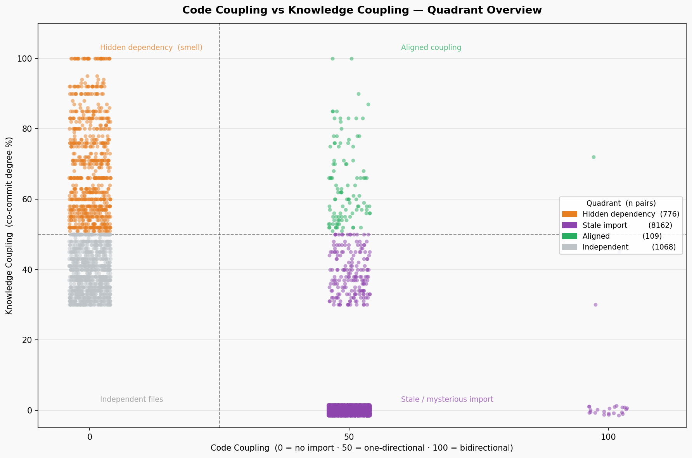
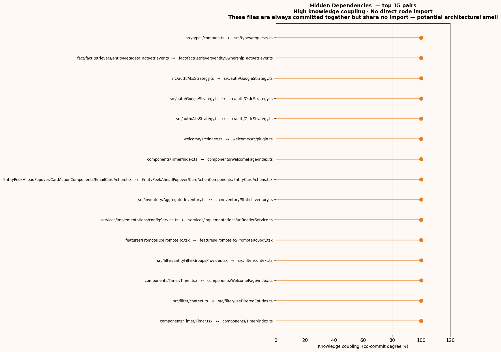
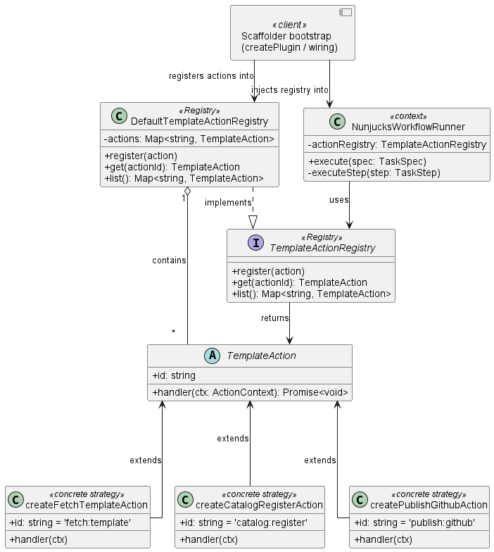

# Software Design

## Dependencies

### Code Dependencies

Code dependencies were extracted using the following `madge` command

```bash
madge --json \
  --extensions ts,tsx \
  --ts-config /Backstage/Backstage_snapshot/tsconfig.json \
  --exclude '\.test\.(ts|tsx)$|\.spec\.(ts|tsx)$|\.stories\.(ts|tsx)$|__mocks__|__fixtures__|__tests__|\.d\.ts$|^\.storybook/' \
  /Backstage/Backstage_snapshot/packages/ \
  /Backstage/Backstage_snapshot/plugins/ \
  > deps.json
```

It builds a dependency graph from `import` statements in `.ts` and `.tsx` files. Test files, mocks, fixtures, stories, and type declarations were excluded using the options above to focus on production code only.

The analysis covers two top-level directories of the Backstage monorepo: `packages/`, which contains core libraries and shared infrastructure and `plugins/`, which contains independently deployable feature modules. Madge automatically excludes the `node_modules` folder.

Using a python script it was possible to visualize dependency distribution


The large majority of files have zero or very few dependencies.

The file which has the most dependencies is `packages/create-app/src/lib/versions.ts`, it references every package in the monorepo to keep version numbers aligned across releases. Its high count is structural.
The `models/index.ts` files are generated automatically from OpenAPI schemas and re-export every model in one place.
Other notable entries include `packages/ui/src/index.ts` and `packages/core-components/src/components/index.ts`, both are public entry points for component libraries, designed to aggregate exports for consumers. `plugins/catalog-backend/src/service/CatalogBuilder.ts` is an exception: it is a manually written orchestrator that wires together many catalog services.


A large number of files have zero dependencies, such as components, icon definitions, theme tokens, and default configuration values. The packages with the most leaf files are `ui` (101), `catalog-backend` (72), `scaffolder-backend` (66), and `core-components` (61), reflecting the large number of self-contained components and handlers concentrated in these areas.


### Knowledge Dependencies

Knowledge dependencies measure how often two files are changed together in the same commit. Unlike code dependencies, they are derived from the history of the repository and reflect how the development team actually works in practice.

The git log was extracted from the Backstage snapshot (2026-04-09), then filtered using a bash script to remove bot commits, merge commits, and unusually large changesets. The script filters data in the same way as code dependencies are filtered to make the comparison more meaningful. As a result of this filtering the consideres files are `.ts` and `.tsx` files and the ones which path begins with `packages/` or `plugins/`. Excluded files are dependency folders, build and configuration files, test folders and stylesheets. This way the filtered log file contains only human-made commits related to production code. 

```bash
    if (tolower(header) ~ /dependabot|renovate|\[bot\]|goalie|imgbot|github-actions/) next

    out = header; count = 0
    for (i = 2; i <= NF; i++) {
        if ($i == "") continue
        split($i, f, "\t")
        if (length(f) < 3) continue
        p = tolower(f[3])
        if (p ~ /^(\.changeset|node_modules|dist|build|coverage|\.yarn|\.storybook)\//) continue
        if (p ~ /\/__mocks__\/|\/__fixtures__\/|\/__tests__\//) continue
        if (p ~ /\.(test|spec|stories)\.(ts|tsx)$/) continue
        if (p ~ /\.d\.ts$/) continue
        if (p !~ /\.(ts|tsx)$/) continue
        if (p !~ /^(packages|plugins)\//) continue
        out = out "\n" $i; count++
    }
    if (count == 0 || count > 30) next
    print out
```
>Above a snippet of the filtering script.

Coupling analysis was performed using `code-maat`

```bash
docker run -v /home/stealve/code_maat:/data code-maat \
  -l /data/git_log_filtered.log \
  -c git2 -a coupling \
  --min-revisions 5 --min-coupling 30 \
  > ../coupling.csv
```

In the obtained output the `degree` value (0–100%) represents the share of commits in which both files of a pair were modified together.
The `--min-revisions 5` parameter excludes file pairs where at least one file has been modified fewer than 5 times in total.
The `--min-coupling 30` parameter excludes pairs whose degree is below 30%.
The following graphs show how many co-change partners each file has.


Using `analyze_coupling.py` the obtained output is a JSON file where for each file is shown its amount of coupled files and the average degree.
The following chart represents a ranking of the top 15 files in terms of coupling.



The first file is `HasSubcomponentsCard/HasSubcomponentsCard.tsx` with 14 coupled partners and an average degree of 47.4% the highest coupling count in the list. This catalog UI component evolves together with several other relationship cards (`HasSystemsCard`, `HasResourcesCard`, etc.).

The second group of files is the `plugins/scaffolder-backend-module-github/src/actions/` group: `github.ts`, `githubRepoCreate.ts`, `githubAutolinks.ts`, `githubIssuesLabel.ts`, `githubDeployKey.ts`, `githubBranchProtection.ts`, and `githubWebhook.ts` all appear in the top 15, with 11–12 coupled partners each and average degrees between 42% and 60%. These files implement individual GitHub actions for the Backstage scaffolder and follow a shared interface. When one action is added or modified, the others are typically updated at the same time to maintain consistency.

The last group is `packages/cli/src/modules/`: `info/index.ts`, `translations/index.ts`, `migrate/index.ts`, and `config/index.ts` all have 11–12 couplings, with `migrate/index.ts` reaching an average degree of 65.4%. CLI sub-modules are wired together through a central initializer (`CliInitializer.ts`, also in the top 15), so changes to the CLI architecture tend to propagate across all modules simultaneously.

The following bar chart shows how many files having only one partner there are in each package.



In total, 753 files across the codebase have exactly one coupled partner. The package with the most such files is cli (57), followed by catalog-backend (42), scaffolder (36), and scaffolder-backend (33). This means that a large share of files in these packages co-evolve with only one other file, suggesting highly localized changes rather than broad cross-cutting modifications. Several of these pairs have a degree of 100%, every commit that touched one also touched the other. Examples include `packages/cli-node/src/pacman/PackageManager.ts` with `Yarn.ts` and `plugins/scaffolder/src/filter/EntityFilterGroupsProvider.tsx` with `context.ts`, reflecting a strict co-evolution rule rather than high activity.

### Comparison
Using the filters described before it is possible to work with the same set of files.
Each file pair was assigned a code score based on the direction of static imports:

| Import relationship | Code score |
| ------------------- | ---------- |
| No import           | 0          |
| One-way (A → B)    | 50         |
| Bidirectional       | 100        |

Bidirectional contains both direct and indirect dependencies. The first ones are certainly the circular dependencies, but it is not possible to know for sure the nature of the last ones.
The knowledge score is the `degree` from `coupling.csv` (0–100%). Combining the two scores places each pair in one of four quadrants:

| Quadrant                    | Code | Knowledge | Interpretation                                               |
| --------------------------- | ---- | --------- | ------------------------------------------------------------ |
| **Aligned**           | high | high      | Coupling is consistent                                       |
| **Hidden dependency** | low  | high      | Always co-changed, no import — architectural smell          |
| **Stale import**      | high | low       | Import declared but rarely co-changed — stable or vestigial |
| **Independent**       | low  | low       | No coupling of either kind                                   |

It is possible to represent the relationship between knowledge and code dependencies using the following scatter matrix. Each point in this plot is a pair of files.


The majority of pairs are in the Stale Import quadrant (8162 pairs, over 80%), reflecting a codebase where many static dependencies are stable abstractions rarely modified together. The Independent quadrant is the second largest (1068 pairs). The Aligned quadrant, though the smallest (109 pairs), confirms that statically coupled files are also frequently co-changed. The two asymmetric quadrants are the most analytically interesting.

The pairs in the hidden dependencies quadrant are frequently committed together but do not have static imports. It reveals an implicit and logical coupling not explicitly formalized.


The pairs in the stale import quadrant have a static import relationship but rarely appear in the same commit. Two interpretations are possible. The first is positive: the imported module is a stable abstraction that encapsulates change well, so the importing file almost never needs updating when the dependency changes. The second may be unsafe: the import may be vestigial so it was declared in the past but it is no longer actively used.


## Design Patterns

### Facade

The first analized pattern is a facade, a structural pattern, and it is used to hide the complexity of the interactions between an interface and many types and functions because exposing them  directly would force every consumer to understand and coordinate them. Without the facade, adding or refactoring an internal component would require changes in every caller. In `Backstage` the facade is seen in [`AppManager.tsx`](https://github.com/Group06-SwDA/Backstage_snapshot/blob/master/packages/core-app-api/src/app/AppManager.tsx#L161).
On [`types.ts`](https://github.com/Group06-SwDA/Backstage_snapshot/blob/master/packages/core-app-api/src/app/types.ts#L306) is defined the `BackstageApp` interface  with methods getPlugins(), getSystemIcon(), createRoot(), getProvider(), getRouter() with which the client interacts. This interface is implemented on AppManager.tsx which is wiring private attributes and methods together without exposing them to the caller.
The final consumer is [`App.tsx`](https://github.com/Group06-SwDA/Backstage_snapshot/blob/master/packages/app/src/App.tsx) which instantiates the app through [`createApp`](https://github.com/Group06-SwDA/Backstage_snapshot/blob/master/packages/app-defaults/src/createApp.tsx`#L36) which in turn calls `createSpecializedApp()`.

For instance the consumer calls `createRoot()` which among other things indirectly calls a private method named [`getApiHolder()`](https://github.com/Group06-SwDA/Backstage_snapshot/blob/master/packages/core-app-api/src/app/AppManager.tsx#L427-L523), which is longer and more complex than createRoot().


**Alternative**: There is not an efficient and clear alternative to this pattern.
It is possible to evaluate a Singleton to guarantee one single instance of the App and a builder to simplify its [`creation`](https://github.com/Group06-SwDA/Backstage_snapshot/blob/master/packages/app/src/App.tsx#L132). An Abastract Factory can also be used but AppManager links together etherogeneous elements so it would not be the right choice. All alternatives address construction or instantiation concerns, but neither hides the internal complexity of the subsystem from the consumer, which is the core responsibility of the Facade.

### Strategy

The second analysed pattern is a Strategy, a behavioral pattern,used to define a family of interchangeable algorithms to be replaced or tested in isolation, without touching the client since the algorithm is decoupled from the object which is using it.

In `Backstage` the strategy is defined through the type [`TemplateAction`](https://github.com/Group06-SwDA/Backstage_snapshot/blob/master/plugins/scaffolder-node/src/actions/types.ts#L113). One of the possible contexts that can be used is [`NunjucksWorkflowRunner`](https://github.com/Group06-SwDA/Backstage_snapshot/blob/5b61c2f33998f647b59f413bb2747983af15e8db/plugins/scaffolder-backend/src/scaffolder/tasks/NunjucksWorkflowRunner.ts#L329).
[`DefaultTemplateActionRegistry`](https://github.com/Group06-SwDA/Backstage_snapshot/blob/5b61c2f33998f647b59f413bb2747983af15e8db/plugins/scaffolder-backend/src/scaffolder/actions/TemplateActionRegistry.ts#L45), which is instantiated at startup by the client and implements the [`TemplateActionRegistry`](https://github.com/Group06-SwDA/Backstage_snapshot/blob/5b61c2f33998f647b59f413bb2747983af15e8db/plugins/scaffolder-backend/src/scaffolder/actions/TemplateActionRegistry.ts#L31) interface, is not a strict GoF component needed to implement the strategy but serves a supporting role. It builds a dictionary of TemplateAction, one of which is returned to the context for example [`NunjucksWorkflowRunner`](https://github.com/Group06-SwDA/Backstage_snapshot/blob/5b61c2f33998f647b59f413bb2747983af15e8db/plugins/scaffolder-backend/src/scaffolder/tasks/NunjucksWorkflowRunner.ts#L329). There are some [builtin](https://github.com/Group06-SwDA/Backstage_snapshot/tree/5b61c2f33998f647b59f413bb2747983af15e8db/plugins/scaffolder-backend/src/scaffolder/actions/builtin) concrete strategies and some external [ones](https://github.com/Group06-SwDA/Backstage_snapshot/blob/5b61c2f33998f647b59f413bb2747983af15e8db/plugins/scaffolder-backend-module-github/src/actions/github.ts#L51).
Each concrete action implements a different handler unknown to the client, executed by the [context](https://github.com/Group06-SwDA/Backstage_snapshot/blob/5b61c2f33998f647b59f413bb2747983af15e8db/plugins/scaffolder-backend/src/scaffolder/tasks/NunjucksWorkflowRunner.ts#L530) by invoking its handler.
It is important to note that TemplateAction is a typescript Type and not an interface like in the GoF pattern but it plays the same role.


**Alternative: Template Method**
An alternative to the Strategy could be the Template method, where a base abstract class would define a fixed execution structure leaving subclasses to implement only the specific behaviour but this would be less appropriate in this context since the concrete actions are too different and unreleated to each other, having nothing in common except receiving an ActionContext. Moreover using template method if a new plugin needs to be added the code should be recompiled and redistributed.
In template method, TemplateAction becomes an abstract class defining handler() as the abstract step. Concrete actions are subclasses that override handler() through inheritance. The structure is fixed at compile time but makes the algorithm structure explicit. Despite having many drawbacks for `Backstage` system the template method could be implemented as follows.


### Builder

The third analysed pattern is a fluent-builder, a creational pattern, used to build a complex object piece by piece using several methods including the last one to finalize its creation. Forcing all DevApp configuration into a single constructor call would be unreadable and hard to extend.

In `Backstage` [`DevAppBuilder`](https://github.com/Group06-SwDA/Backstage_snapshot/blob/master/packages/dev-utils/src/devApp/render.tsx#L97) in `render.tsx` exposes methods like `registerPlugin()`, `addPage()`, and `addThemes()` that populate private arrays and return `this` for chaining. The React component tree is assembled only when [`build()`](https://github.com/Group06-SwDA/Backstage_snapshot/blob/master/packages/dev-utils/src/devApp/render.tsx#L229) is called inside [`render()`](https://github.com/Group06-SwDA/Backstage_snapshot/blob/master/packages/dev-utils/src/devApp/render.tsx#L309) which is the last method that the client calls to insert the DevApp in the DOM. [`createDevApp()`](https://github.com/Group06-SwDA/Backstage_snapshot/blob/master/packages/dev-utils/src/devApp/render.tsx#L340) instantiatiates a new builder. For `Backstage`, differently from pure GoF, there is only a concrete builder without an interface and each client is also a director since it chains every method it needs. One example of client is the [`catalog graph plugin`](https://github.com/Group06-SwDA/Backstage_snapshot/blob/5b61c2f33998f647b59f413bb2747983af15e8db/plugins/catalog-graph/dev/index.tsx#L167-234).


**Alternative: Abstract Factory**

A possible alternative is the following Abstract Factory. The concrete products rapresent the actual specific DOM components created by the builders.

The pro is that it is not necessary to build the pipeline every time a DevApp is needed. The drawback is that is not incremental and not flexible. Each DevApp requires its own factory.

### Observer

The Observer pattern, a behavioral pattern, is used when some changes in an object, called subject, influence others called observers. The subject keeps a collection of observers and notifies them of its changes.
In `Backstage` the concrete subject is represented by [`BehaviorSubject`](https://github.com/Group06-SwDA/Backstage_snapshot/blob/5b61c2f33998f647b59f413bb2747983af15e8db/packages/core-app-api/src/lib/subjects.ts#L125) which implements the [`Observable<T> type`](https://github.com/Group06-SwDA/Backstage_snapshot/blob/5b61c2f33998f647b59f413bb2747983af15e8db/packages/types/src/observable.ts#L63) and `ZenObservable.SubscriptionObserver<T>` which comes from the external library `zen-observable`. Both of them play the role of the GoF subject interface. In particular, the former exposes the `subscribe()` method and indirectly the `unsubscribe()` method through the [`Subscription type`](https://github.com/Group06-SwDA/Backstage_snapshot/blob/5b61c2f33998f647b59f413bb2747983af15e8db/packages/types/src/observable.ts#L33) and the latter exposes the methods `next()`, `error()` and `complete()` which correspond to the `notify()` in GoF. Specifically in `Backstage` `ZenObservable.SubscriptionObserver<T>` also represents the observer interface, so from the observer side subscribers implement this methods to receive updates on the subject, and from the subject side they are implemented to notify a new theme value.`BehaviorSubject` keeps a set of [`ZenObservable.SubscriptionObserver<T>`](https://github.com/Group06-SwDA/Backstage_snapshot/blob/5b61c2f33998f647b59f413bb2747983af15e8db/packages/core-app-api/src/lib/subjects.ts#L156-158) a collection of subscribers. One example of concrete observer is a lambda function defined in [`AppThemeSelector`](https://github.com/Group06-SwDA/Backstage_snapshot/blob/5b61c2f33998f647b59f413bb2747983af15e8db/packages/core-app-api/src/apis/implementations/AppThemeApi/AppThemeSelector.ts#L42-48) which is passed to the overloaded `subscribe` method instead of the one accepting only an [`Observer type`](https://github.com/Group06-SwDA/Backstage_snapshot/blob/5b61c2f33998f647b59f413bb2747983af15e8db/packages/types/src/observable.ts#L22). The `Observer type` is not actually used in this example but could be used by other observer implementation. To summarize the user changes a theme and the subject notifies all observers about this change and each one implements its own logic, for example the one analysed persists the themeId in the browser.


**Alternative: Command**

A possible alternative is a command, implemented as follows.
Here AppThemeSelector becomes an active component since it knows exactly which command to execute, while before it only sent notifications without knowing what concrete observers would have done.


The pro is that the relation between AppThemeSelector and the Receiver is explicit and easy to trace in the client and it is not necessary to send notifications. The drawback is that there is no dynamic subscription of observers so the invoker has to hold a list of command objects that are explicitly invoked so adding a new reaction requires modifying the invoker's command list.
