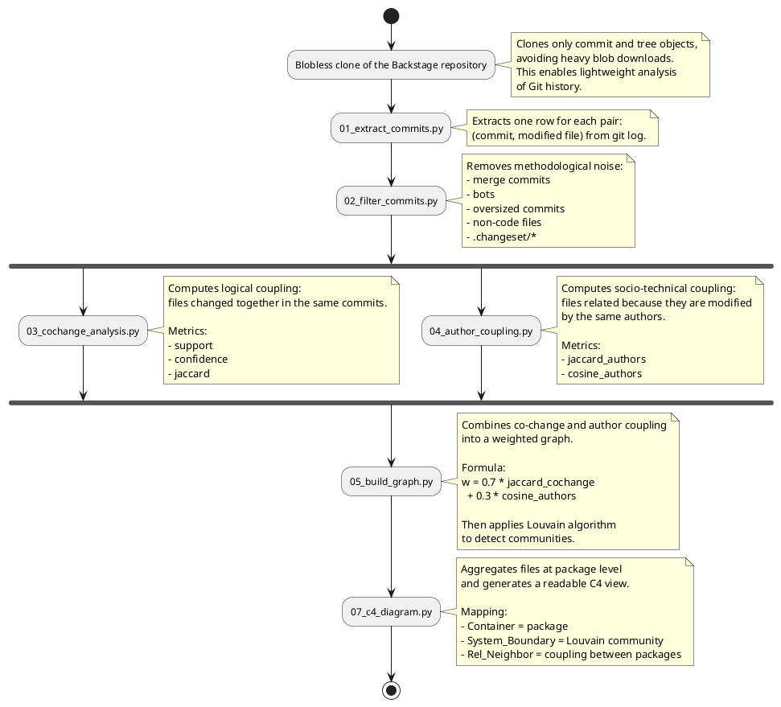
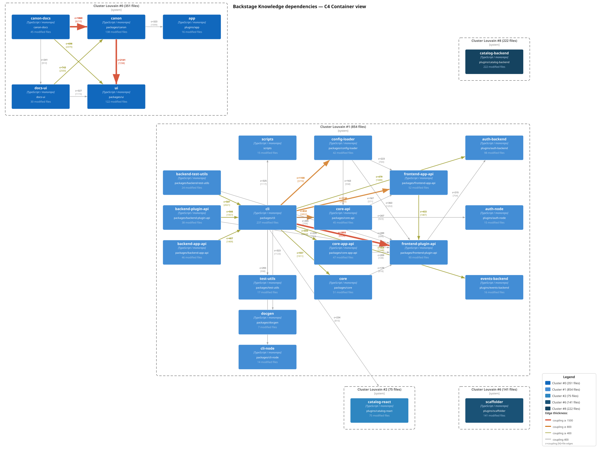
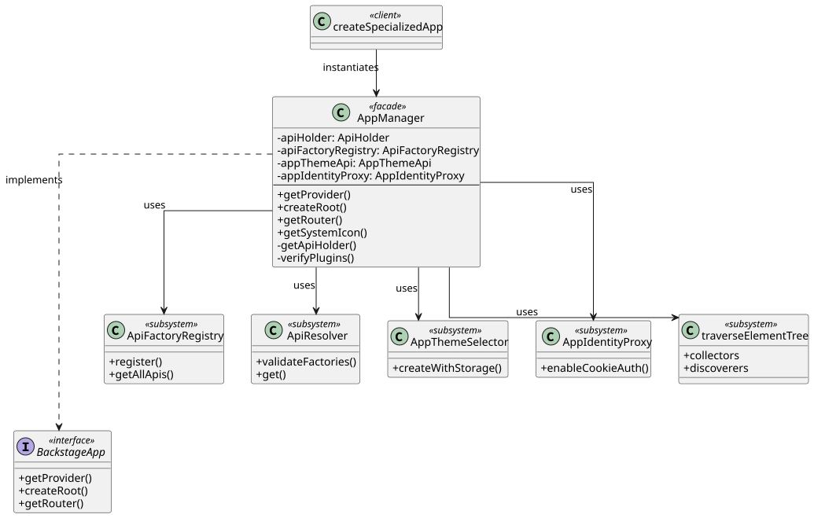
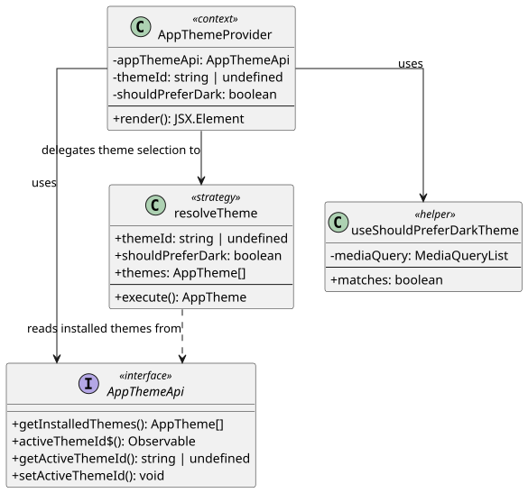
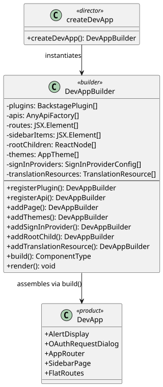
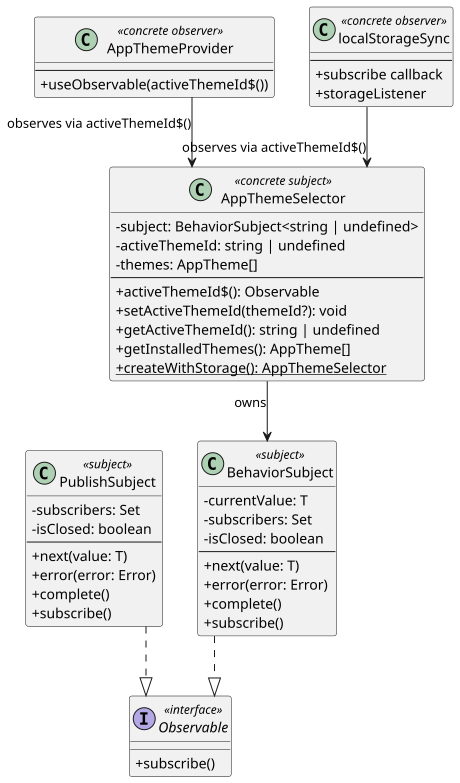

# Software Design

## Dependencies

### Code Dependencies

### Knowledge Dependencies

To analyse the knowledge dependencies the following pipeline was used

The end result is:

## Design Patterns

### Facade

The first analized code is [`AppManager.tsx`](https://github.com/Group06-SwDA/Backstage_snapshot/blob/master/packages/core-app-api/src/app/AppManager.tsx#L161). 
It'is a facade, a structural pattern, and it is used to hide the complexity of the interactions between an interface and many types and functions because exposing them  directly would force every consumer to understand and coordinate them. Without the facade, adding or refactoring an internal component would require changes in every caller.
On [`types.ts`](https://github.com/Group06-SwDA/Backstage_snapshot/blob/master/packages/core-app-api/src/app/types.ts#L306) is defined the `BackstageApp` interface  with methods getPlugins(), getSystemIcon(), createRoot(), getProvider(), getRouter() with which the client interacts. This interface is implemented on AppManager.tsx which is wiring private attributes and methods together without exposing them to the caller.
The final consumer is [`App.tsx`](https://github.com/Group06-SwDA/Backstage_snapshot/blob/master/packages/app/src/App.tsx) which instantiates the app through [`createApp`](https://github.com/Group06-SwDA/Backstage_snapshot/blob/master/packages/app-defaults/src/createApp.tsx`#L36) which in turn calls `createSpecializedApp()`.

For instance the consumer calls `createRoot()` which among other things indirectly calls a private method named [`getApiHolder()`](https://github.com/Group06-SwDA/Backstage_snapshot/blob/master/packages/core-app-api/src/app/AppManager.tsx#L427-L523), which is longer and more complex than createRoot().

There is not an efficient and clear alternative to this pattern. 
It is possible to evaluate a Singleton to guarantee one single instance of the App and a builder to simplify its [`creation`](https://github.com/Group06-SwDA/Backstage_snapshot/blob/master/packages/app/src/App.tsx#L132). Both alternatives address construction or instantiation concerns, but neither hides the internal complexity of the subsystem from the consumer, which is the core responsibility of the Facade.

__
### Strategy

[`AppThemeProvider`](https://github.com/Group06-SwDA/Backstage_snapshot/blob/master/packages/core-app-api/src/app/AppThemeProvider.tsx#L69) calls [`resolveTheme`](https://github.com/Group06-SwDA/Backstage_snapshot/blob/master/packages/core-app-api/src/app/AppThemeProvider.tsx#L23-L47) passing `themeId`, `shouldPreferDark`, and the installed `themes`. The strategy encapsulates a four-level fallback: match by explicit ID, prefer dark variant, fall back to light variant, fall back to the first available theme.

**Which classes play which role?**

- **Context**: `AppThemeProvider`, delegates theme selection without knowing the algorithm.
- **Strategy**: `resolveTheme`, the interchangeable algorithm encapsulating the four-level fallback logic.

**Why is the pattern used?**
Embedding the selection logic inside `AppThemeProvider` would mix UI rendering concerns with theme-resolution logic, making both harder to test and maintain independently.

**Which problem does it solve?**
It avoids a large conditional block inside the component and allows the selection algorithm to be replaced or tested in isolation, without touching the provider.

**Alternative: Template Method**
Template Method also separates a stable algorithm core from its variations, but via inheritance instead of composition: an abstract class defines the skeleton and subclasses override the variable steps.

- *Pro*: simpler, no extra strategy interface or objects; the variation is handled at class definition time.
- *Con*: static binding (the algorithm can't be swapped at runtime); each new selection rule requires a new subclass; inheritance is less flexible than passing a function.

### Builder

[`DevAppBuilder`](https://github.com/Group06-SwDA/Backstage_snapshot/blob/master/packages/dev-utils/src/devApp/render.tsx#L94) in `render.tsx` exposes methods like `registerPlugin()`, `addPage()`, and `addThemes()` that populate private arrays and return `this` for chaining. The React component tree is assembled only when [`build()`](https://github.com/Group06-SwDA/Backstage_snapshot/blob/master/packages/dev-utils/src/devApp/render.tsx#L215) is called; [`createDevApp()`](https://github.com/Group06-SwDA/Backstage_snapshot/blob/master/packages/dev-utils/src/devApp/render.tsx#L325) acts as director by instantiating a fresh builder.

**Which classes play which role?**

- **Builder**: `DevAppBuilder`, accumulates configuration through chainable methods (`registerPlugin`, `addPage`, `addThemes`).
- **Director**: `createDevApp()`, instantiates a fresh builder and drives the construction sequence.

**Why is the pattern used?**
A dev app has many optional parts (plugins, pages, themes) that need to be composed incrementally. Forcing all configuration into a single constructor call would be unreadable and hard to extend.

**Which problem does it solve?**
It avoids a constructor with a large number of optional parameters and decouples the configuration phase from the construction phase: `build()` can enforce invariants once, rather than on every setter call.

**Alternative: Abstract Factory**
Abstract Factory also creates complex objects without exposing their concrete classes, but it produces families of related products in one shot rather than assembling a single object step by step.

- *Pro*: good when several related objects must always be created together; no director or chaining API needed.
- *Con*: all products are created at once, no incremental or conditional assembly; harder to enforce that certain steps happen before others; optional parts need extra factory variants.

### Observer

[`subjects.ts`](https://github.com/Group06-SwDA/Backstage_snapshot/blob/master/packages/core-app-api/src/lib/subjects.ts) defines [`BehaviorSubject<T>`](https://github.com/Group06-SwDA/Backstage_snapshot/blob/master/packages/core-app-api/src/lib/subjects.ts#L123), which holds a `Set` of active subscribers and fans out each `next(value)` to all of them, replaying the current value to any new subscriber (unlike [`PublishSubject`](https://github.com/Group06-SwDA/Backstage_snapshot/blob/master/packages/core-app-api/src/lib/subjects.ts#L31)). [`AppThemeSelector`](https://github.com/Group06-SwDA/Backstage_snapshot/blob/master/packages/core-app-api/src/apis/implementations/AppThemeApi/AppThemeSelector.ts) wraps a private `BehaviorSubject` exposed read-only via [`activeThemeId$()`](https://github.com/Group06-SwDA/Backstage_snapshot/blob/master/packages/core-app-api/src/apis/implementations/AppThemeApi/AppThemeSelector.ts#L78): calling [`setActiveThemeId()`](https://github.com/Group06-SwDA/Backstage_snapshot/blob/master/packages/core-app-api/src/apis/implementations/AppThemeApi/AppThemeSelector.ts#L85) notifies all observers: `useObservable` re-renders the UI and the observer in [`createWithStorage()`](https://github.com/Group06-SwDA/Backstage_snapshot/blob/master/packages/core-app-api/src/apis/implementations/AppThemeApi/AppThemeSelector.ts#L30) persists the choice to `localStorage`.

**Which classes play which role?**

- **Subject**: `AppThemeSelector`, holds the state and exposes `activeThemeId$()` for subscription.
- **Concrete observable**: `BehaviorSubject<T>` in `subjects.ts`, manages the subscriber set and fans out notifications; replays the current value to new subscribers.
- **Observers**: `useObservable` in `AppThemeProvider` (re-renders the UI) and the storage callback in `createWithStorage()`

**Why is the pattern used?**
Two independent reactions (UI update and persistence) must happen whenever the active theme changes. The observer pattern lets both subscribe without `AppThemeSelector` knowing about either of them.

**Which problem does it solve?**
It decouples the source of a state change from everything that must react to it. Without the pattern, `setActiveThemeId()` would have to call the UI updater and the storage writer explicitly, creating direct dependencies on both.

**Alternative: Command**
Instead of observers subscribing dynamically, the subject could hold a list of Command objects that are explicitly invoked when the state changes, each encapsulating one reaction.

- *Pro*: explicit and easy to trace; supports undo/redo and logging; no hidden notification chain.
- *Con*: tight coupling between the subject and the specific commands it must invoke; no dynamic subscribe/unsubscribe; adding a new reaction requires modifying the subject's command list.