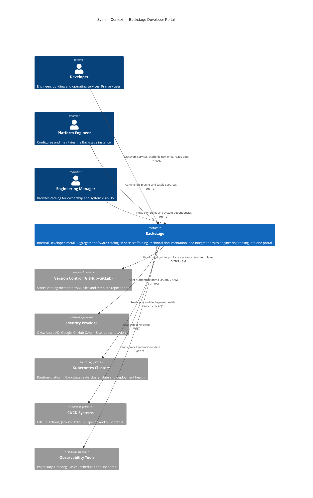
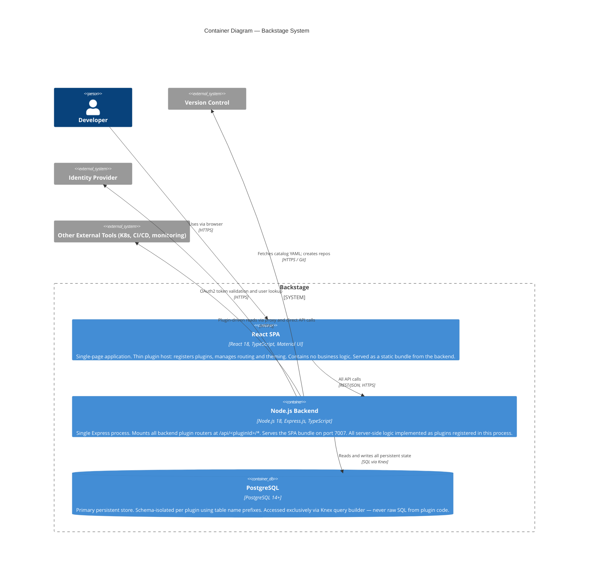
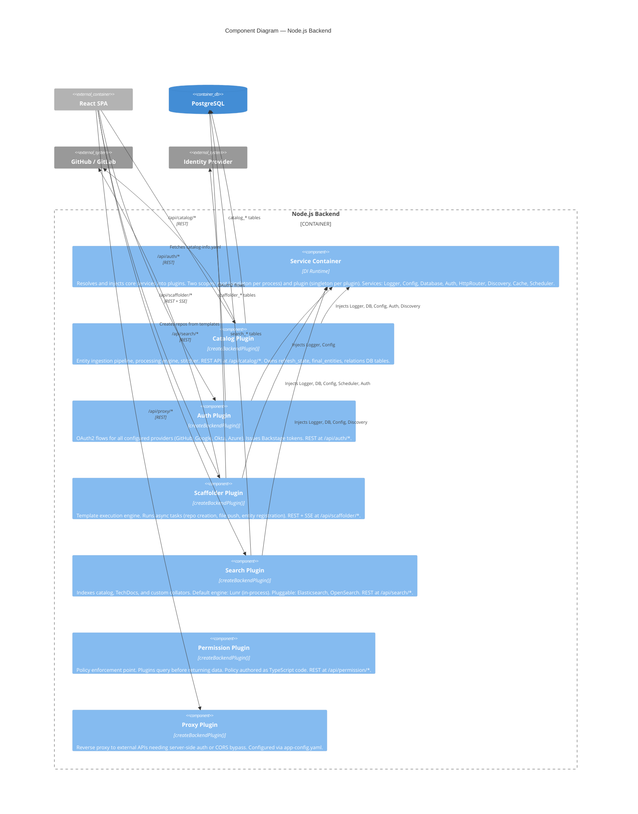
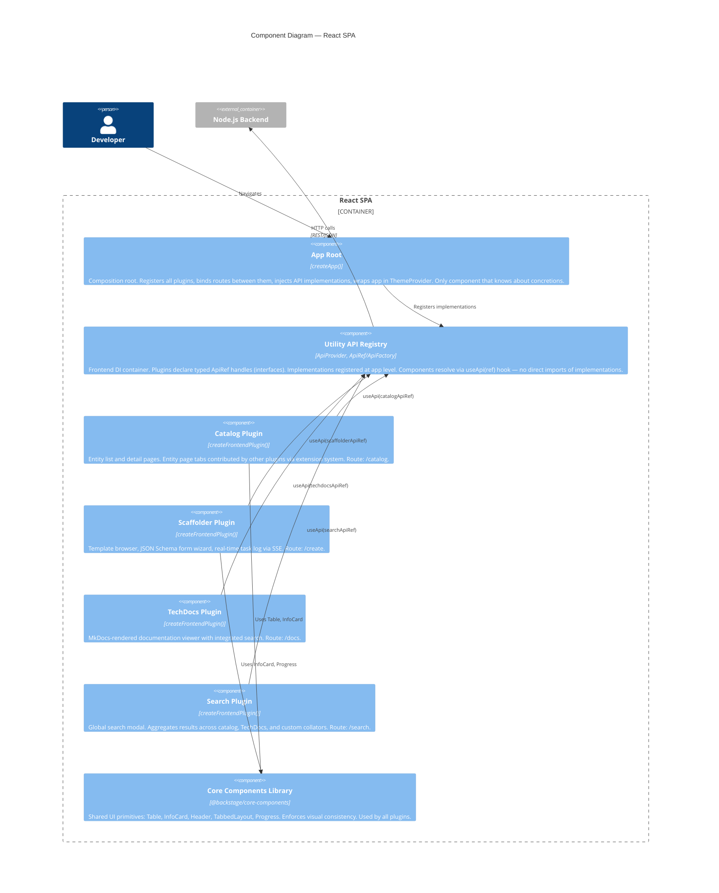

# Backstage — Architecture Report
### System: [backstage/backstage](https://github.com/backstage/backstage) · Analyzed: April 2026

---

## Tooling

**Diagramming tool:** [Mermaid](https://mermaid.js.org/) with native C4 diagram support (`C4Context`, `C4Container`, `C4Component` diagram types).

Mermaid was selected because:
- Text-based (diagrams version-controlled alongside documentation)
- Native C4 syntax support without external tooling or accounts
- Renders natively in GitHub, VS Code (Markdown Preview Mermaid Support extension)
- Produces consistent, readable output without manual layout

Per the [C4 tooling page](https://c4model.com/tooling), Mermaid is listed as a free, code-based option supporting C4 notation at all three levels documented here.

---

## 1. Context Level

### 1.1 Context Diagram

### 1.2 Context Explanation

Backstage is an **Internal Developer Portal (IDP)** open-sourced by Spotify, now a CNCF incubating project. Its primary function is *aggregation*: it does not replace existing engineering tools (GitHub, Kubernetes, PagerDuty) but provides a single coherent interface over them, organized around software components rather than individual tool dashboards.

Three user roles interact with the system. Developers are the primary users — they discover existing services via the Software Catalog, scaffold new ones via template-driven forms, and read technical documentation. Platform engineers maintain the instance, configure plugins, and define catalog ingestion rules. Engineering managers use the catalog for system ownership and dependency visibility.

The most important external relationships are with **Version Control** (metadata stored as YAML in repositories, following a GitOps pattern) and the **Identity Provider** (all access mediated by OAuth2/SAML — Backstage issues no long-lived credentials). Kubernetes, CI/CD, and observability integrations are read-only; Backstage aggregates data, it does not control infrastructure.

---

## 2. Container Level

### 2.1 Container Diagram

> Note: The optional **Cache layer** (Redis) is omitted from the main diagram. It is not required for deployment — all plugins fall back to in-memory caching — and it introduces no architectural boundary, only a performance optimization. It is referenced in the explanation below.

### 2.2 Container Explanation

Backstage deploys as **two runtime containers** (SPA + backend) backed by one database. This is a deliberate simplicity trade-off: a single backend process is operationally straightforward and enables zero-friction local development. The cost is that individual backend plugins cannot be scaled independently — the entire backend scales horizontally as one unit.

The **React SPA** is architecturally thin by design. It functions as a plugin host: its only responsibilities are registering installed plugins, wiring routes between them, and applying the theme. No business logic resides in the SPA itself.

The **Node.js backend** is a monolithic Express process where backend plugins are registered modules, not separate services. Plugins communicate with each other exclusively via HTTP (using an internal `DiscoveryService` to resolve plugin base URLs), which means the monolith could be decomposed into separate processes without changing plugin code — a valuable architectural property.

**PostgreSQL** uses table-name prefixes to provide logical schema isolation per plugin (e.g., `catalog_*`, `scaffolder_*`, `auth_*`). Plugins never share tables; cross-plugin data access goes through HTTP APIs.

The **Cache layer** (Redis or in-memory) is omitted from the container diagram because it is not a required architectural boundary. It is an optional deployment-time optimization with no impact on the logical architecture.

---

## 3. Clean Architecture Relationship

Backstage shows partial alignment with Clean Architecture (CA), with notable deviations.

**Alignments:**

| CA Layer | Backstage Equivalent |
|----------|---------------------|
| Entities (domain) | `@backstage/catalog-model` — Entity schema, kinds, validators. Pure TypeScript, no framework dependencies. Shared across frontend and backend. |
| Use Cases | Backend plugin `init()` functions and processing engines — e.g., `CatalogProcessingEngine`. Orchestrate domain logic without depending on delivery mechanism. |
| Interface Adapters | Express routers (`createRouter()`) and frontend API implementations (`CatalogClient implements CatalogApi`). Convert between HTTP and domain representations. |
| Frameworks & Drivers | Express.js, React, Knex, Material UI. Outermost layer — replaceable in principle. |

**Deviations:**

The `DiscoveryService` and plugin-to-plugin HTTP calls violate the CA dependency rule in a subtle way: use-case layer code (plugin init) must know about infrastructure-level service IDs to locate other plugins. This is an inversion of the ideal flow.

More significantly, the `packages/app` host **imports concrete plugin packages** to register them — not interfaces. In CA, the composition root is acceptable as the only place knowing about concretions, but here the boundary is not enforced by the type system.

The `@backstage/catalog-react` shared package — containing hooks, contexts, and entity utilities used by many plugins — acts as a **shared kernel** in Domain-Driven Design terms. While pragmatic, it creates coupling between the catalog and every other plugin that imports it, which CA would discourage.

Overall: Backstage reflects Clean Architecture *intent* (separation of domain from infrastructure, dependency inversion through ApiRef and ServiceRef) without strict layer enforcement.

---

## 4. Component Level

### 4.1 Component Diagram — Node.js Backend

### 4.2 Component Diagram — React SPA

### 4.3 Component Explanation

Backend plugins are registered modules within a single Express process. Each declares service dependencies via `ServiceRef` tokens — the `Service Container` resolves the dependency graph at startup and injects scoped instances. Plugin-scoped services (Logger, Database) are isolated: each plugin receives its own namespaced instance.

Frontend plugins use an equivalent `ApiRef` system: typed interface handles resolved by the `Utility API Registry`. A component calls `useApi(catalogApiRef)` and receives whatever implementation was registered at the app level — the component has no import dependency on the concrete class.

---

## 5. SOLID Violations at Component Level

### Single Responsibility Principle (SRP)
**Violation — Catalog Plugin.** The catalog backend component handles entity ingestion (fetching YAML from VCS), processing (validator chain), stitching (assembling final entity), persistence (DB writes), and REST API serving. These are distinct responsibilities that change for different reasons. Separation would suggest: `CatalogIngestionEngine`, `CatalogStore`, `CatalogApiRouter` as distinct components.

### Open/Closed Principle (OCP)
**Partial violation — `packages/backend` host.** Adding a new backend plugin requires modifying `packages/backend/src/index.ts` to import and register it. The file must be edited to extend behavior. The new `createBackend()` API (introduced in recent Backstage versions) partially addresses this by making registration more declarative, but the file still requires modification.

**Good application — Extension Points.** The `CatalogExtensionPoint` exposes hooks (`addProcessor`, `addEntityProvider`) that allow modules to extend catalog behavior without modifying catalog plugin code. This is OCP applied correctly.

### Interface Segregation Principle (ISP)
**Violation — `CatalogApi` frontend interface.** The interface bundles read operations (`getEntities`, `getEntityByRef`, `getEntityFacets`) with mutation operations (`addLocation`, `removeEntityByUid`, `refreshEntity`). Components that only display catalog data are forced to depend on mutation methods they never use.

### Dependency Inversion Principle (DIP)
**Good application.** Both DI systems (backend `ServiceRef`, frontend `ApiRef`) enforce DIP: high-level plugin code depends on abstractions (`coreServices.database`, `catalogApiRef`), not on concrete classes. Implementations are injected by the composition root.

**Partial violation.** `packages/app` (the composition root) must import concrete plugin packages. While a composition root is the accepted location for concretion knowledge, the absence of any interface enforcement means any plugin code could accidentally import from another plugin's `src/` directly — the type system does not prevent it.

### Liskov Substitution Principle (LSP)
No significant violations observed. The `ServiceFactory` and `ApiFactory` patterns are interface-driven; substitution is the intended mechanism.

---

## 6. Architectural Characteristics

### Extensibility
The **plugin system** is the primary architectural mechanism for extensibility. Every feature is a plugin; none receives special platform privileges. The **Extension Point** pattern allows deep customization (adding entity processors, auth providers, search collators) without forking core plugins. This is supported structurally: `catalog-backend-module-github` extends the catalog without a single line changed in `catalog-backend`.

### Testability
Both DI systems (frontend and backend) directly enable unit testability. Plugin code never imports concrete implementations — tests inject mock services via the same `ServiceRef`/`ApiRef` mechanism used in production. The `@backstage/test-utils` package provides pre-built test harnesses for both layers.

### Scalability
The backend is **stateless by design** — no in-memory sessions, no local disk writes in standard configuration. This enables horizontal scaling via Kubernetes replica increase with no code changes. Spotify's reported production scale (40+ GKE clusters, ~270,000 pods) validates the architecture under significant load. The main scalability bottleneck is the single PostgreSQL instance; this is addressed through connection pooling and, at extreme scale, read replicas.

### Coupling and Cohesion Analysis

**Backend plugin cohesion: HIGH.** Each backend plugin owns its route namespace (`/api/<id>/*`), its DB schema prefix (`<id>_*`), and its background jobs. Changes to the catalog do not require touching the scaffolder. This is **functional cohesion** — all elements of a plugin work toward one well-defined purpose.

**Backend plugin coupling: LOW.** Inter-plugin communication is exclusively HTTP. The `DiscoveryService` resolves plugin base URLs at runtime. No plugin imports another plugin's source code. This is **data coupling** (only message data crosses boundaries), the loosest form.

**Frontend coupling: MODERATE.** The `@backstage/catalog-react` shared package (entity hooks, context, entity card components) is imported by many plugins — search, TechDocs, Kubernetes, and others all depend on it. This **shared kernel** creates coupling: changes to `catalog-react` interfaces ripple across many plugins. It is an acknowledged trade-off for developer convenience.

**Core-components coupling: LOW-RISK.** `@backstage/core-components` is a stable, intentionally shared library. Its coupling is comparable to depending on a UI framework — acceptable because the package has strong backward-compatibility guarantees.

**Afferent/Efferent coupling summary:**

| Package | Ca (afferent) | Ce (efferent) | Instability I = Ce/(Ca+Ce) |
|---------|--------------|--------------|---------------------------|
| `catalog-model` | High (many import it) | Low | ~0.1 — stable, correct |
| `catalog-react` | High | Moderate | ~0.3 — stable but watch |
| `core-components` | High | Low | ~0.1 — stable, correct |
| `plugin-catalog-backend` | Low | High | ~0.8 — volatile, correct |
| `packages/app` | Near 0 | High | ~1.0 — composition root, correct |

The instability distribution follows the **Stable Dependencies Principle**: packages imported by many others (`catalog-model`, `core-components`) have low instability; leaf packages like individual backend plugins have high instability, meaning they can change freely without impacting others.

### Maintainability
The **monorepo structure** (Yarn Workspaces + Lerna) ensures all packages share one lockfile and one build toolchain (`@backstage/cli`). This reduces "it works on my machine" drift and makes cross-plugin refactoring atomic. The trade-off is CI complexity: the full test suite across 100+ packages is expensive without incremental build caching.

### Availability
Kubernetes deployment with stateless replicas provides high availability. The `RootLifecycleService` handles graceful shutdown (drains in-flight requests before pod termination). Background processing jobs (catalog refresh, search indexing) are distributed across replicas using database-backed locking to prevent duplicate work.

---

## Sources

- [C4 Model](https://c4model.com) · [C4 Tooling](https://c4model.com/tooling) · [Mermaid C4](https://mermaid.js.org/syntax/c4.html)
- [Backstage Architecture Overview](https://backstage.io/docs/overview/architecture-overview/)
- [Backend Services / DI](https://backstage.io/docs/backend-system/architecture/services/)
- [Frontend Plugin Architecture](https://backstage.io/docs/frontend-system/architecture/plugins/)
- [Utility APIs](https://backstage.io/docs/api/utility-apis)
- [Extension Points](https://backstage.io/docs/backend-system/architecture/extension-points/)
- [Stable Dependencies Principle — Clean Architecture, Robert C. Martin]
