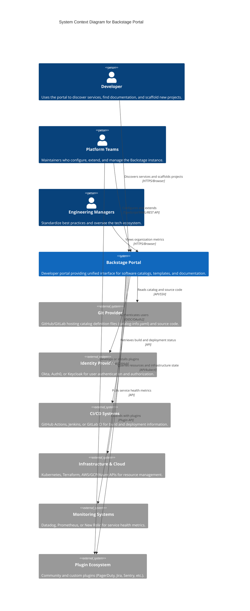
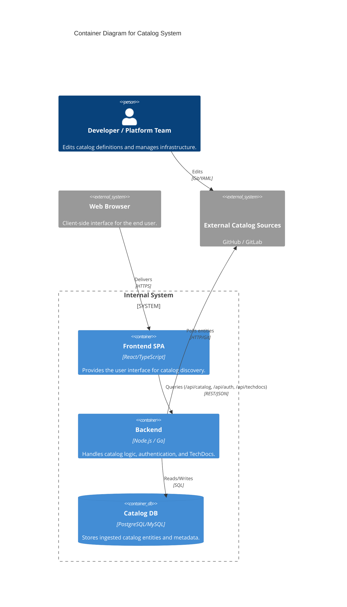

# Backstage Architecture Analysis

**Project:** [backstage/backstage](https://github.com/backstage/backstage)
**Inspection date:** 2026-04-29
**Method:** Static code analysis of GitHub repository

---

## 1. Context Level (C4-L1)

### Description

Backstage is an open-source developer portal platform originally built by Spotify. Its primary purpose is to centralize software catalog data, documentation, scaffolding, and tooling for engineering organizations. At the context level, the system sits between development teams and a large number of external systems.

### External Actors and Systems


### Context Diagram (textual C4)



---

## 2. Container Level (C4-L2)

### Containers

| Container | Technology | Responsibility |
|---|---|---|
| **Frontend SPA** | React, TypeScript, Material UI | Single-page app. Plugin registry, DI container for API implementations, route management |
| **Backend** | Node.js, Express, TypeScript | Plugin host. Exposes `/api/<plugin-id>` routes. Service DI container |
| **Catalog Database** | PostgreSQL (prod) / SQLite (dev) | Stores processed entities, relations, locations. Accessed via Knex (isolated per plugin) |
| **Static Config** | `app-config.yaml` | Runtime configuration injected via `core.rootConfig` service |
| **External Catalog Sources** | Git repositories | Host `catalog-info.yaml` descriptor files; polled by catalog-backend |

### Container Interaction

### Key Design Decisions at Container Level

**Monorepo / Plugin Model.** The repo uses Yarn workspaces. Each plugin is an npm package with `backstage.role` set to `frontend-plugin`, `backend-plugin`, or `common-library`. This enforces container boundaries at the package manager level — a frontend plugin cannot import from a backend plugin because they have different runtime targets.

**URL-based Service Discovery.** Backend plugins discover each other not via direct imports but via `DiscoveryService`:
```typescript
getBaseUrl(pluginId: string): Promise<string>      // internal: http://10.x.x.x/api/catalog
getExternalBaseUrl(pluginId: string): Promise<string>  // external: https://backstage.example.com/api/catalog
```
This means containers can be deployed to different hosts without code changes.

**Two-scope DI.** Backend services have `scope: 'root'` (process-wide singletons: config, lifecycle, root logger) vs `scope: 'plugin'` (isolated per plugin: database, cache, logger). Plugin isolation is enforced by design, not convention.

---

## 3. Component Level (C4-L3)

### Catalog Subsystem — Frontend Components

| Component | Package | Responsibility |
|---|---|---|
| `CatalogIndexPage` | `@backstage/plugin-catalog` | Main catalog browse page. Uses `catalogApiRef` to fetch entity list |
| `CatalogEntityPage` | `@backstage/plugin-catalog` | Entity detail page. Uses `EntitySwitch` for kind-conditional rendering |
| `EntityLayout` | `@backstage/plugin-catalog` | Tabbed layout for entity detail. Other plugins inject tabs via extension system |
| `EntitySwitch` | `@backstage/plugin-catalog` | Conditional rendering based on entity `kind`/`spec.type` — Strategy pattern in JSX |
| `CatalogTable` | `@backstage/plugin-catalog` | Reusable tabular list of entities with column configuration |
| `CatalogClient` | `@backstage/catalog-client` | HTTP client. Adapter between frontend React world and REST API |
| `catalogPlugin` (frontend) | `@backstage/plugin-catalog` | Composition root: declares `routes`, `apis` (factories), registers `catalogApiRef` |

### Catalog Subsystem — Backend Components

| Component | Package | Responsibility |
|---|---|---|
| `catalogPlugin` (backend) | `@backstage/plugin-catalog-backend` | Composition root: registers HTTP routes under `/api/catalog`, wires DI |
| `CatalogProcessingEngine` | `plugin-catalog-backend` | Orchestrates the multi-stage entity processing pipeline |
| `UrlReaderProcessor` | `plugin-catalog-backend` | Fetches `catalog-info.yaml` from remote URLs via `UrlReaderService` |
| `PlaceholderProcessor` | `plugin-catalog-backend` | Resolves `$text`, `$yaml`, `$json` placeholder references in entity specs |
| `BuiltinKindsEntityProcessor` | `plugin-catalog-backend` | Validates built-in entity kinds against their JSON schemas |
| `CodeOwnersProcessor` | `plugin-catalog-backend` | Reads CODEOWNERS file to derive `spec.owner` |
| `AnnotateLocationEntityProcessor` | `plugin-catalog-backend` | Enriches entities with location origin metadata |
| `CatalogDatabase` | `plugin-catalog-backend` | Knex-based persistence. Manages entities, relations, and refresh schedules |

### Processing Pipeline Architecture

The catalog-backend processing engine implements a **Chain of Responsibility** pattern:

```
[Location] 
  ──[UrlReaderProcessor]──→ raw YAML bytes
  ──[PlaceholderProcessor]──→ resolved YAML
  ──[BuiltinKindsEntityProcessor]──→ validated Entity
  ──[AnnotateLocationEntityProcessor]──→ annotated Entity
  ──[CodeOwnersProcessor]──→ owner-enriched Entity
  ──→ [CatalogDatabase: store + emit relations]
```

Each processor implements `CatalogProcessor` interface. The pipeline is open for extension: operators add custom processors via the `CatalogProcessorExtensionPoint`.

### Frontend DI Component Architecture

```
[App.tsx: composition root]
  └── createApp({
        apis: [
          createApiFactory({
            api: catalogApiRef,
            deps: { discoveryApi, fetchApi, identityApi },
            factory: deps => new CatalogClient(deps)
          })
        ],
        plugins: [catalogPlugin, techdocsPlugin, ...]
      })

[CatalogIndexPage]
  └── const catalogApi = useApi(catalogApiRef)  // resolved at runtime via DI
  └── catalogApi.getEntities(...)
```

### Backend DI Component Architecture

```
[backend/src/index.ts: composition root]
  └── const backend = createBackend()
  └── backend.add(catalogPlugin())
  └── backend.add(catalogModuleGithubEntityProvider())  // optional extension

[catalogPlugin]
  └── registerInit({
        deps: { 
          database: coreServices.database,    // → KnexDatabaseService
          logger: coreServices.logger,        // → WinstonLoggerService  
          httpRouter: coreServices.httpRouter, // → ExpressHttpRouterService
          scheduler: coreServices.scheduler   // → SchedulerService
        },
        async init({ database, logger, httpRouter, scheduler }) {
          const router = await createRouter({ database, logger, scheduler })
          httpRouter.use(router)
        }
      })
```

---

## 4. Relationship with Clean Architecture

### Mapping

Robert C. Martin's Clean Architecture defines four concentric rings: Entities, Use Cases, Interface Adapters, Frameworks & Drivers. Backstage maps closely to this structure:

| Clean Architecture Ring | Backstage Layer | Packages |
|---|---|---|
| **Entities** (Enterprise Business Rules) | Domain model | `@backstage/catalog-model`, `@backstage/types`, `@backstage/errors` |
| **Use Cases** (Application Business Rules) | Plugin logic | `plugin-catalog` (browse/filter logic), `plugin-catalog-backend` (processing engine) |
| **Interface Adapters** | Adapters & Presenters | `catalog-client` (HTTP adapter), Processors (SCM adapters), Express routes |
| **Frameworks & Drivers** | Infrastructure | React, Express, Knex, MUI, OpenTelemetry, Winston |

### Dependency Rule Compliance

Clean Architecture's cardinal rule: dependencies point inward (toward Entities). Backstage enforces this via package dependency constraints:

```
catalog-model (Entities):
  deps → @backstage/types, @backstage/errors, ajv, zod
  NO React, NO Express, NO Knex

catalog-client (Interface Adapters):
  deps → catalog-model, core-plugin-api
  NO direct DB, NO Express

plugin-catalog (Use Cases + Adapters):
  deps → catalog-model, catalog-client, core-plugin-api
  NO catalog-backend import

plugin-catalog-backend (Use Cases + Frameworks):
  deps → catalog-model, backend-plugin-api, express, knex
```

The dependency direction strictly flows outward. `catalog-model` knows nothing about React or Express. This is architecturally verified at compile time by TypeScript.

### Where It Diverges

The `plugin-catalog-backend` package mixes Use Case logic (processing engine) with Framework wiring (Express routes, Knex setup). A strict Clean Architecture would separate these into distinct packages. In Backstage, this trade-off is consciously accepted for operational simplicity.

---

## 5. SOLID Principles at Component Level

### Single Responsibility Principle (SRP)

**Upheld.** Each backend service interface has exactly one responsibility:
- `LoggerService`: logging only
- `DatabaseService`: DB access only  
- `SchedulerService`: distributed task scheduling only
- `CacheService`: key-value caching only
- `AuthService`: credential verification and token issuance only

Each processor has one transformation responsibility. `UrlReaderProcessor` fetches. `PlaceholderProcessor` resolves. `BuiltinKindsEntityProcessor` validates.

**Minor violation observed.** `AuthService` handles both authentication (verify token → credentials) and authorization token issuance (`getPluginRequestToken`, `getLimitedUserToken`). These are distinct concerns that bleed into each other.

### Open/Closed Principle (OCP)

**Strongly upheld.** The extension point system is the primary mechanism:

```typescript
// Core plugin declares extension point — closed for modification
const catalogProcessingExtensionPoint = createExtensionPoint<CatalogProcessorExtensionPoint>({
  id: 'catalog.processing',
});

// External module extends behavior — no core code changed
createBackendModule({
  moduleId: 'github-entity-provider',
  register(env) {
    env.registerExtensionPoint(catalogProcessingExtensionPoint, {
      addProcessor(processor) { /* inject custom processor */ }
    });
  }
})
```

The catalog processing pipeline is extended without modifying `plugin-catalog-backend`.

### Liskov Substitution Principle (LSP)

**Upheld at domain level.** All entity kinds (`ComponentEntity`, `ApiEntity`, `ResourceEntity`, etc.) extend `Entity`. TypeScript structural subtyping means any function accepting `Entity` accepts any kind. The `EntitySwitch` component iterates over entity predicates — any subtype is handled uniformly until a specific predicate matches.

**Upheld at service level.** Any `LoggerService` implementation (Winston, Pino, console mock for tests) is substitutable without callers knowing.

### Interface Segregation Principle (ISP)

**Strongly upheld.** 21 narrow backend service interfaces are defined separately. Plugins declare only the specific services they need:

```typescript
registerInit({
  deps: {
    logger: coreServices.logger,      // only this
    database: coreServices.database,  // and this
    // NOT: coreServices.scheduler (if not needed)
  }
})
```

Frontend follows the same pattern: 11+ separate `ApiRef<T>` tokens. No god-bag API object.

### Dependency Inversion Principle (DIP)

**Strongly upheld throughout.** The entire architecture is built on this principle:

- Frontend plugins depend on `ApiRef<T>` tokens (abstractions), never on concrete implementations
- `CatalogClient` is resolved via `catalogApiRef` — swappable (useful for testing)
- Backend plugins depend on `ServiceRef<T>` tokens from `coreServices`
- No plugin imports a concrete service class; all wiring happens in composition roots (`App.tsx`, `backend/src/index.ts`)

---

## 6. Architectural Characteristics

### Extensibility

**Primary design goal.** The entire plugin system exists to enable extensibility without modifying core:
- Frontend: `createPlugin` + `createApiFactory` + `ExternalRouteRef` binding
- Backend: `createBackendPlugin` + `createExtensionPoint` + `createBackendModule`
- Data: `spec: JsonObject` (open schema) + `metadata.annotations` (escape hatch for arbitrary metadata)

Rating: **Very High**. Adding a new domain capability requires only a new plugin package.

### Maintainability

ADR004 (module export structure) enforces deterministic import tracing. Every public symbol is traceable through `index.ts` chains to its source. Combined with TypeScript strict mode, refactoring is mechanically safe.

`@internal` JSDoc annotation on non-public symbols prevents accidental external coupling. The `role` field in `package.json` (`backstage` section) makes package boundaries machine-readable.

Rating: **High**. The discipline breaks down only where packages grow large (e.g., `plugin-catalog-backend` mixing use cases and infrastructure).

### Testability

The DI system makes every dependency substitutable. Frontend components receive API implementations via `ApiRef` — mocked with `MockApis` in tests. Backend plugins receive service implementations injected — testable without real DB/auth.

`catalog-model` has zero framework dependencies, making domain logic unit-testable without any setup.

Rating: **High**.

### Scalability

- Backend: plugins are stateless HTTP handlers; horizontal scaling of the backend process is straightforward
- Catalog: `SchedulerService` provides distributed task locking (prevents duplicate processing across instances)
- Database: Knex abstraction allows underlying DB swap (SQLite → PostgreSQL for scale)
- Service Discovery via `DiscoveryService` enables multi-process deployments where different plugin backends run on separate hosts

Rating: **Medium-High**. The single shared database is a scaling bottleneck for very large catalogs.

### Observability

Built-in at infrastructure level:
- `LoggerService` — structured logging per plugin
- `AuditorService` — audit trail for security events
- `SchedulerService` — task execution tracking
- `@opentelemetry/api` in `plugin-catalog-backend` dependencies → distributed tracing
- Root health endpoint via `core.rootHealth` service

Rating: **High**. Observability is a first-class service, not an afterthought.

### Security

- `AuthService` — token validation for every incoming request
- `HttpRouterService.addAuthPolicy` — explicit per-route auth policy declarations
- `PermissionsService` + `PermissionsRegistryService` — fine-grained authorization
- `getLimitedUserToken` — token scoping for least-privilege inter-service calls
- `BackstageCredentials<T>` — typed credential objects distinguishing user, service, and none principals

Rating: **High**. Auth and permissions are core services, not plugin-level concerns.

### Coupling and Cohesion Metrics (qualitative)

**Afferent coupling (Ca — incoming dependencies):**
- `@backstage/catalog-model`: very high Ca (depended on by both frontend and backend plugins) → stable, rarely changed
- `@backstage/core-plugin-api`: very high Ca (every frontend plugin depends on it) → must be backward-compatible
- `@backstage/types`: highest Ca (foundational primitives) → virtually frozen

**Efferent coupling (Ce — outgoing dependencies):**
- `@backstage/catalog-model`: very low Ce (only `types`, `errors`, `ajv`, `zod`) → **independent package**
- `plugins/catalog-backend`: high Ce (catalog-model, backend-plugin-api, express, knex, permissions) → complex, many responsibilities

**Instability (I = Ce / (Ca + Ce)):**
- `catalog-model`: I ≈ 0 (maximally stable) — correct for domain model
- `catalog-backend`: I closer to 1 (many deps) — acceptable for application layer

**Cohesion:** Each service interface is highly cohesive (all methods serve one concept). `plugin-catalog-backend` has lower cohesion by mixing pipeline, routes, and DB — this is the primary tech debt candidate.

---

## Summary

Backstage implements a **plugin-based micro-frontend + modular backend** architecture. Its strongest architectural qualities are extensibility (via the DI + extension point system), dependency inversion (enforced at the package boundary level via TypeScript), and observability (built-in as core services). The architecture closely follows Clean Architecture's dependency rule, with `catalog-model` as the innermost stable domain layer. SOLID principles are consistently applied, with the only notable concern being `plugin-catalog-backend`'s mixed responsibilities. The primary scaling constraint is the shared relational database, which would require sharding or event-driven processing for very large-scale deployments.
