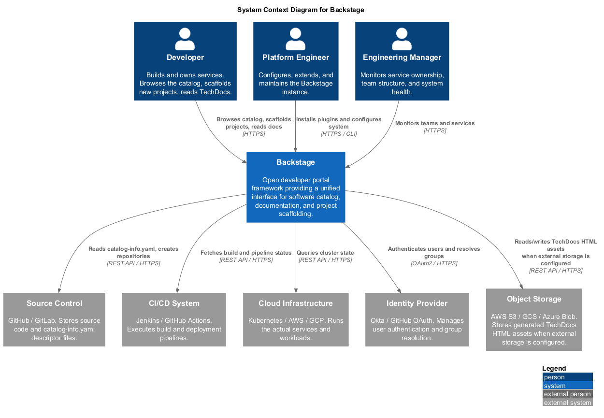
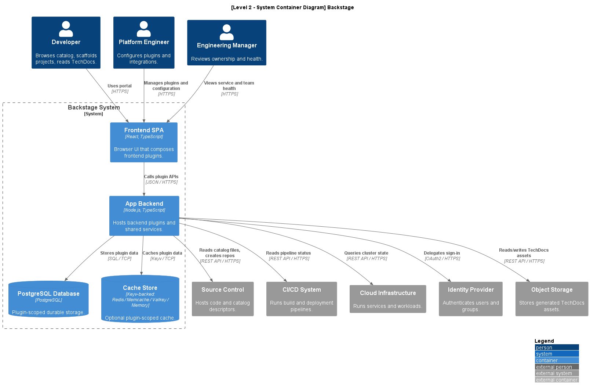
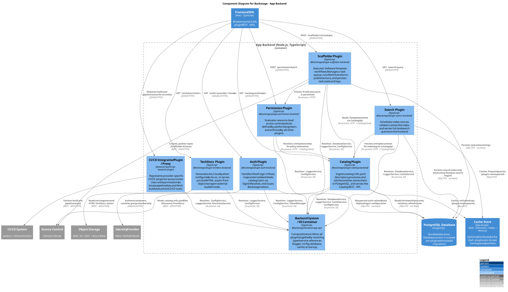

# Software Architecture Report: Backstage

**System:** [Backstage](https://github.com/backstage/backstage)  
**C4 diagrams tool:** PlantUML with the C4-PlantUML standard library

---

## 1. Context Level

### Diagram

### Explanation

Backstage is an internal developer portal framework originally created by Spotify and now hosted by the Cloud Native Computing Foundation (CNCF). Its main goal is to give engineering teams one place to discover services, read documentation, understand ownership, and create new projects from approved templates. In this way, Backstage reduces the amount of scattered knowledge that developers normally have to collect from many different tools.

At the context level, Backstage is the central system used by three main groups of people.

**Developers** are the primary users of the portal. They register services by adding `catalog-info.yaml` descriptor files to their repositories, then use Backstage to browse the software catalog, inspect service metadata, read TechDocs, and scaffold new projects.

**Platform Engineers** are responsible for setting up and maintaining the Backstage instance. They configure plugins, connect external integrations, manage authentication, and adapt the portal to the needs of the organization.

**Engineering Managers** mostly use Backstage in a read-only way. They use it to understand service ownership, team structures, and the general health of the engineering ecosystem.

Backstage also depends on several external systems. Source Control, such as GitHub or GitLab, is one of the most important dependencies because Backstage reads `catalog-info.yaml` files from repositories and can also create new repositories through scaffolder templates. CI/CD systems, such as Jenkins or GitHub Actions, provide build and deployment status that can be displayed in the catalog. Cloud Infrastructure, such as Kubernetes, AWS, or GCP, is queried so that teams can see runtime and resource information related to their services. Finally, an Identity Provider, such as Okta or GitHub OAuth, authenticates users and resolves group membership, which Backstage maps to `User` and `Group` catalog entities.

---

## 2. Container Level

### Diagram

### Explanation

At the container level, Backstage is mainly organized around a **Frontend SPA**, an **App Backend**, a **PostgreSQL database**, and an optional **Redis cache**.

**Frontend SPA.** The frontend is a React and TypeScript single-page application that runs in the user's browser. It brings together all installed frontend plugins, such as the Catalog UI, Scaffolder UI, TechDocs reader, Kubernetes dashboard, and Search. The application itself works mostly as a composition layer: it wires plugin extensions into one portal experience. Frontend plugins can share functionality through Backstage Utility APIs and can link to each other through the Backstage routing system. The frontend communicates with external systems through the App Backend instead of calling those systems directly.

**App Backend.** The backend is a Node.js and TypeScript runtime that hosts Backstage backend plugins. In a typical deployment, several backend plugins run inside the same backend process, but they are still designed to remain logically isolated. The backend application mainly acts as a composition root and dependency injection container: it wires together plugins, shared services such as logging and configuration, database access, and plugin modules. Each backend plugin exposes its own APIs and owns its own responsibilities. When plugins need to coordinate, for example when Search indexes Catalog entities, they should interact through defined APIs rather than by sharing internal implementation details. This design also makes it possible to split plugins into separate backend deployments when stronger isolation or independent scaling is needed.

**PostgreSQL.** PostgreSQL is the main durable data store for Backstage. Backend plugins keep their data isolated by using separate logical schemas and independent migrations. This reduces coupling between plugins and helps prevent one plugin's data model from leaking into another plugin.

**Redis Cache Store.** Redis is optional for local development, but it is useful in production as a distributed cache. Backstage plugins use a Keyv-compatible cache client, and each plugin can use its own namespace to avoid key collisions.

**Object Storage.** Object storage is modeled as an external system because it is normally provided by a managed third-party service, such as AWS S3, Google Cloud Storage, or Azure Blob Storage. Backstage integrates with it, for example to read or write generated TechDocs assets, but it is not deployed as part of the Backstage application itself.

### Relationship With Clean Architecture

Backstage does not implement Clean Architecture in strict textbook form, but its design is broadly compatible with its core principles: domain logic is kept away from infrastructure, dependencies flow inward toward stable abstractions, and concrete infrastructure is wired in at the outermost composition layer.

### Layer Mapping

| Clean Architecture Layer | Backstage Equivalent |
|---|---|
| **Entities** | Shared domain packages such as `catalog-model`, defining entity types (`Component`, `API`, `User`, `Group`, etc.) with no dependency on Express, PostgreSQL, Redis, or any frontend framework. |
| **Use Cases** | Application-level backend plugin logic: Catalog ingestion, entity processing, validation, stitching, and Scaffolder task orchestration. The Scaffolder is a concrete example — it takes a template and user parameters as input, orchestrates fetch/transform/publish steps, and produces a scaffolded repository as output. |
| **Interface Adapters** | REST route handlers in backend plugins, the `catalog-client` package (translates HTTP responses into typed domain objects), frontend API clients, and React presenter components. |
| **Frameworks and Drivers** | The `app/` and `backend/` composition roots, Express routing, Knex database access, Redis/Keyv cache integration, identity providers, source-control integrations, and all other concrete infrastructure. |

### Dependency Rule and Dependency Inversion

The dependency direction follows the Clean Architecture rule at the package level. The `catalog-client` is a clear application of Dependency Inversion: consumers depend on the `CatalogApi` interface, not on Catalog internals, decoupling them from the plugin's implementation and deployment topology. The new backend system formalises this through typed service references resolved at the composition root, keeping dependencies pointing inward. Cross-plugin communication is expected to happen over the network rather than through direct code imports, enforcing a hard boundary between plugins.

One nuance: plugins sharing the same backend process do share services (logger, database, cache) through the DI container. These are provided as abstractions, so the inversion principle still applies, but the boundary is a service interface rather than a network call.

### Boundary Crossing and Ports and Adapters

Clean Architecture requires that only data shaped for the inner layer crosses a boundary — never raw database rows or internal objects. In well-structured areas, such as the Catalog, this holds: `catalog-client` wraps responses in typed `Entity` objects defined by the shared domain model. In older or less mature plugins, database-level structures are sometimes more visible than they should be. Boundary discipline is enforced by convention (`@internal` annotations, code review) rather than by hard compile-time constraints.

Backstage also aligns with the Ports and Adapters pattern through its swappable infrastructure: the Keyv cache abstraction hides whether Redis or in-memory storage is used; the `SignInResolver` interface decouples identity logic from the choice of provider (Okta, GitHub OAuth, etc.); and TechDocs storage adapters work interchangeably across AWS S3, GCS, and Azure. This allows infrastructure decisions to be deferred or changed without touching plugin logic.

### Testability

Plugin isolation supports testability: core logic can be exercised using mock implementations of the logger, database, and cache provided by Backstage's testing utilities. However, some route handlers mix HTTP plumbing with business logic rather than delegating to a thin, independently testable layer — the Humble Object pattern Clean Architecture recommends. Boundary discipline here is inconsistent across the codebase.

# Component Level

## 3.1 Container Selection and Scope

At Level 3, the goal is to zoom inside a single container and show what is actually running inside it. Out of the five containers identified at Level 2 — the Frontend SPA, the App Backend, PostgreSQL, the Redis Cache Store, and Object Storage — three are worth zooming into for this analysis.

The **App Backend** is the obvious first choice. This is where all the real behaviour lives: ingestion, scaffolding, authentication, search, access control. Skipping it would leave the most interesting part of the architecture unexplained.

The **Catalog Plugin** gets its own deep-dive because it sits at the centre of everything else. Every other plugin depends on it in some way, and its internal design — the provider/processor pipeline, the stitching step, the `CatalogApi` interface boundary — illustrates the core patterns used across the whole backend better than any other single plugin.

The **Frontend SPA** is included because Backstage is not a typical frontend-backend split. The frontend has its own plugin system, its own dependency injection mechanism, and its own isolation rules that mirror what the backend does. Leaving it out would give a misleading picture of the architecture.

**PostgreSQL and Redis are intentionally left out.** They are infrastructure — managed services with no application logic inside them. What belongs to them at Level 3 is already captured in the Container diagram: schemas owned by plugins, namespaced cache partitions. Drawing component diagrams for a database would be modelling data, not architecture.

---

## 3.2 Diagram — App Backend Components

### Diagram

### Explanation

The App Backend runs seven components inside a single Node.js process: a **Backend System / DI Container** that wires everything together, and six backend plugins — **Catalog**, **Scaffolder**, **Auth**, **TechDocs**, **Search**, and **Permission** — each responsible for one distinct capability.

**Backend System / DI Container.** Think of this as the backend's startup script, but with a strict contract. It is implemented in `@backstage/backend-app-api` and its job is to take every registered plugin and hand it exactly the services it declared it needs — a database connection, a logger, a cache client, a config reader. No plugin goes out and constructs these itself. This keeps the concrete infrastructure — Knex for SQL, Pino for logging, Keyv for caching — confined to one place, and everything above it depends only on abstract service interfaces. In Clean Architecture terms, this is the outermost layer: the place where all the details are wired up so the inner layers never have to know about them.

**Catalog Plugin.** This is the component everything else depends on, directly or indirectly. It pulls entity descriptor files from source control on a schedule, runs them through a processing pipeline, resolves relationships between entities, and stores the final results in PostgreSQL. Other plugins that need catalog data — Search, Scaffolder, Permission — do not call into the catalog's code directly. They go through the `CatalogApi` interface, which is implemented by an HTTP client in the `catalog-client` package. This boundary is deliberate: no plugin should know how the catalog works internally, only what it exposes.

**Scaffolder Plugin.** The scaffolder is what runs when a developer picks a template and fills in a form. Under the hood it is an async task engine: each scaffolding request becomes a task, a worker picks it up, and it executes a chain of actions — fetching template files, transforming them, creating a repository in source control, pushing the result. Task state and step-by-step logs are kept in PostgreSQL so the frontend can stream progress back to the user in real time.

**Auth Plugin.** The Auth plugin handles the sign-in flow for every configured identity provider. Its key design decision is the `SignInResolver` — a swappable piece of logic that takes an external identity (say, a GitHub user) and maps it to a User entity in the catalog. Swap the resolver, and you change how identities are matched without touching anything else. The providers themselves — Okta, GitHub OAuth, Google — are all adapter implementations of the same interface. Different providers, identical contract.

**TechDocs Plugin.** TechDocs turns Markdown files committed alongside source code into rendered documentation. The plugin's job is coordination: it triggers a MkDocs build, takes the generated HTML, and publishes it to whichever object storage bucket is configured. From an architectural standpoint it is an adapter — it sits between Backstage's API layer and two external systems (the source repository and the storage bucket) and translates between them.

**Search Plugin.** Search has two separate jobs running at different times. In the background, scheduled collator jobs reach out to the Catalog and TechDocs APIs, pull down content, and build a search index. At request time, a thin REST endpoint queries that index and returns results. The search engine itself — Lunr by default, Elasticsearch as an alternative — sits behind a `SearchEngine` interface. Swapping engines is a configuration and adapter change, not a logic change.

**Permission Plugin.** The Permission plugin is a cross-cutting authority. When any other plugin needs to decide whether a user is allowed to perform an action — read an entity, run a template, delete a resource — it sends a permission request here and gets back an allow or deny decision. The plugin itself holds no domain logic. It evaluates whatever policies the platform engineer has registered. Its value is that it decouples access control from every domain plugin: none of them need to know the policy rules, only whether a given action is permitted.

**Cross-plugin communication.** One rule holds across the entire backend: plugins do not import each other's code. When Search needs entities from Catalog, it calls `CatalogClient` — an HTTP client — as if Catalog were a remote service, even though both plugins are running in the same process. This is not just a style choice. It means any plugin can be moved into its own separate deployment without touching a single line of plugin code, because the communication boundary already exists.
