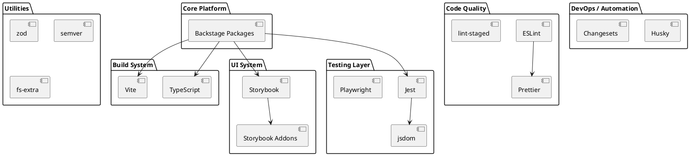

# Package Dependencies UML Diagram

```plantuml
@startuml

package "Core Platform" {
  [Backstage Packages]
}

package "Build System" {
  [TypeScript]
  [Vite]
}

package "UI System" {
  [Storybook]
  [Storybook Addons]
}

package "Testing Layer" {
  [Jest]
  [Playwright]
  [jsdom]
}

package "Code Quality" {
  [ESLint]
  [Prettier]
  [lint-staged]
}

package "DevOps / Automation" {
  [Husky]
  [Changesets]
}

package "Utilities" {
  [zod]
  [semver]
  [fs-extra]
}

' Relationships (you can tweak these)
[Backstage Packages] --> [TypeScript]
[Backstage Packages] --> [Vite]
[Backstage Packages] --> [Storybook]
[Backstage Packages] --> [Jest]

[Storybook] --> [Storybook Addons]
[Jest] --> [jsdom]

[ESLint] --> [Prettier]

@enduml
```
